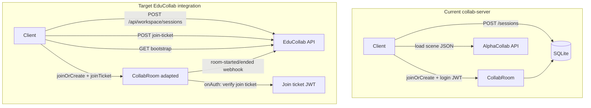
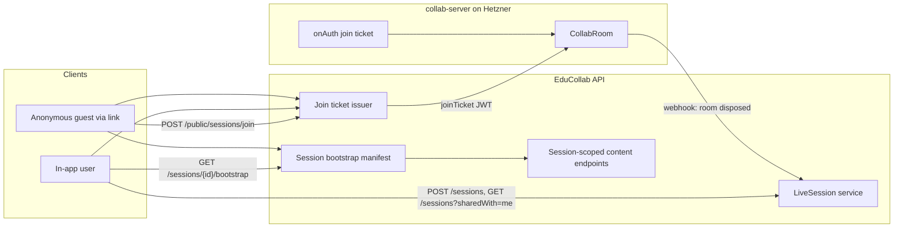

# Colyseus Multiplayer Server ↔ EduCollab API Integration

## Comparison with existing [`Helpers/collab-server`](Helpers/collab-server/)

You already have a production-ready Colyseus server (built for AlphaCollab) in the repo. The plan below **adapts it** rather than starting from scratch.

### Side-by-side

| Area | Existing `collab-server` | EduCollab plan |
|------|--------------------------|----------------|
| **Session source of truth** | Local SQLite (`sessions`, `session_grants`) via [`src/sessions.ts`](Helpers/collab-server/src/sessions.ts) | PostgreSQL in EduCollab API (`LiveSessions`, group/user shares) |
| **Session REST** | Own Express routes in [`src/rest.ts`](Helpers/collab-server/src/rest.ts) (`POST/GET/PATCH/DELETE /sessions`, `/grants`) | `/api/workspace/sessions` in EduCollab API only |
| **Who can join** | Per-user `session_grants` + `defaultRole` fallback; host auto-granted | Group shares + user shares + guest link; resolved in API |
| **Workspace scope** | None — sessions are global to the collab server | Every session tied to `WorkspaceId` + active workspace |
| **Scene/flow binding** | `assetId` (string) + `assetKind` (`scene`\|`flow`) on session record | `sceneId` or `flowId` (int) with API validation |
| **Auth for WebSocket** | Login JWT decoded locally; optional `GET {api}/me` probe ([`src/auth.ts`](Helpers/collab-server/src/auth.ts)) | Short-lived **join ticket** JWT minted by API after share check |
| **Guest/anonymous join** | Not supported — bearer required in `onAuth` | Anonymous via opaque link token + display name |
| **Content bootstrap** | Clients load scene/flow from main API directly; server stores metadata only | API `/sessions/{id}/bootstrap` with manifest + session-scoped download URLs |
| **Asset access toggle** | Not present | `includeAssets` on session; enforced at bootstrap + content endpoints |
| **Live scene edits** | `sceneSync` message relay + in-memory cache for late joiners ([`CollabRoom.ts`](Helpers/collab-server/src/rooms/CollabRoom.ts)) | **Keep this** — initial load from API bootstrap; live deltas via Colyseus |
| **Replicated state** | Camera, cursor, voice, presenter, participants map ([`schema.ts`](Helpers/collab-server/src/rooms/schema.ts)) | **Keep as-is** — already matches needs |
| **Roles** | `host` / `editor` / `presenter` / `viewer` | Map join-ticket role → existing roles (`host`, `editor`/`viewer`, `guest`→`viewer`) |
| **Lifecycle webhooks** | SQLite `status: idle→live→idle` on room create/dispose | API webhooks: `room-started` / `room-ended` |
| **Deployment** | Docker + Hetzner + Caddy ([`README.md`](Helpers/collab-server/README.md)) | **Reuse** — retarget env vars to EduCollab |
| **List shared sessions** | `GET /sessions` — host OR explicit grant only | `GET /api/workspace/sessions?sharedWith=me` — includes group membership |

### Architecture shift



**What to keep from collab-server:** [`CollabRoom`](Helpers/collab-server/src/rooms/CollabRoom.ts), [`schema.ts`](Helpers/collab-server/src/rooms/schema.ts), Docker/Caddy deployment, `filterBy(['sessionId'])`, `wantsSceneSync` opt-in, presence/voice messages.

**What to remove or deprecate:** SQLite session REST (`/sessions`, `/grants`), [`src/db.ts`](Helpers/collab-server/src/db.ts) session tables, login-JWT-as-room-auth, AlphaCollab env var names.

**What to add:** Join ticket verification, API webhook client, guest identity in `onAuth`, optional lightweight cache of session metadata fetched from API on room create.

---

## Recommended split of responsibilities

| Concern | EduCollab API (ASP.NET) | Colyseus ([`Helpers/collab-server`](Helpers/collab-server/)) |
|---------|-------------------------|--------------------------------------------------------------|
| Session CRUD + sharing | Yes — source of truth | No — reads metadata from join ticket or API on room create |
| Who can join | Share resolution + guest tokens | Validates join ticket only |
| Scene/flow content (initial) | Bootstrap manifest + file downloads | No — clients fetch from API before/during join |
| Live scene deltas | Optional future save-back | `sceneSync` relay (existing) |
| Asset access toggle | `includeAssets` on session | N/A |
| Active session list | DB query + lifecycle | Reports room started/ended via webhook |
| Realtime presence | N/A | Existing CollabRoom schema |

Your API already has the right building blocks: group-based sharing ([`GroupAccessResolver`](EduCollab.Application/Services/Groups/GroupAccessResolver.cs)), contextual manifests ([`GetSceneAssetsAsync`](EduCollab.Application/Services/Scenes/SceneService.cs), [`GetFlowScenesAsync`](EduCollab.Application/Services/Flows/FlowService.cs)), and JWT auth ([`AccessTokenService`](EduCollab.Api/Security/AccessTokenService.cs)).



---

## 1. New domain model in EduCollab API

Add tables in [`DbInitializer.cs`](EduCollab.Infrastructure/Database/DbInitializer.cs):

**`LiveSessions`**
- `Id`, `WorkspaceId`, `HostUserId`
- `SceneId` (nullable) XOR `FlowId` (nullable) — exactly one set
- `Status`: `Pending` → `Active` → `Ended` (maps to collab-server `idle`/`live`/`closed`)
- `IncludeAssets` (bool) — host toggle for asset download access
- `AllowGuestLink` (bool)
- `Name`, `Description` (optional — collab-server already uses these)
- `DefaultRole` (optional — mirror collab-server `viewer` default for workspace members without explicit share)
- `CreatedAtUtc`, `StartedAtUtc`, `EndedAtUtc`

**`SessionGroupShares`** — `(SessionId, GroupId)`

**`SessionUserShares`** — `(SessionId, UserId)` — replaces collab-server per-user grants for workspace invites

**`SessionGuestLinks`** — opaque token hash, `SessionId`, `ExpiresAtUtc`, optional `MaxUses`

**`SessionParticipants`** (audit) — `SessionId`, `UserId?`, `GuestId?`, `DisplayName`, `JoinedAtUtc`, `LeftAtUtc`

Sharing resolution reuses [`GroupAccessResolver.ExpandToDescendants`](EduCollab.Application/Services/Groups/GroupAccessResolver.cs).

---

## 2. API endpoints (spec-first)

Follow existing REST conventions from [`ApiEndpoints.cs`](EduCollab.Api/ApiEndpoints.cs).

### Workspace-scoped (authenticated app users)

| Method | Route | Purpose |
|--------|-------|---------|
| `POST` | `/api/workspace/sessions` | Create session from `sceneId` or `flowId`, `groupIds`, `userIds`, `includeAssets`, `allowGuestLink` |
| `GET` | `/api/workspace/sessions?status=active&sharedWith=me` | In-app list (replaces collab-server `GET /sessions`) |
| `GET` | `/api/workspace/sessions/{sessionId}` | Detail + `guestLinkUrl`, effective role |
| `POST` | `/api/workspace/sessions/{sessionId}/join-ticket` | Exchange user JWT for Colyseus join ticket |
| `GET` | `/api/workspace/sessions/{sessionId}/bootstrap` | Content package |
| `POST` | `/api/workspace/sessions/{sessionId}/end` | Host ends session |

Create request example:
```json
{
  "name": "Physics lab",
  "sceneId": 42,
  "groupIds": [3, 7],
  "userIds": [15, 22],
  "includeAssets": true,
  "allowGuestLink": true,
  "defaultRole": "viewer"
}
```

### Public (anonymous guests)

| Method | Route | Purpose |
|--------|-------|---------|
| `POST` | `/api/public/sessions/join` | `{ "guestToken", "displayName" }` → `{ joinTicket, sessionId, colyseusEndpoint }` |

### Session-scoped content

| Method | Route | Purpose |
|--------|-------|---------|
| `GET` | `/api/workspace/session-assets?sessionId=&sceneId=` | Asset manifest |
| `GET` | `/api/workspace/session-assets/content?sessionId=&sceneId=&assetId=` | Download ZIP when `includeAssets=true` |
| `GET` | `/api/workspace/session-scenes/content?sessionId=&sceneId=` | Scene JSON in flow context |

### Internal (Colyseus → API, M2M API key)

| Method | Route | Purpose |
|--------|-------|---------|
| `POST` | `/api/internal/sessions/{sessionId}/room-started` | Replaces SQLite `status: live` in `onCreate` |
| `POST` | `/api/internal/sessions/{sessionId}/room-ended` | Replaces SQLite `status: idle` in `onDispose` |

---

## 3. How Colyseus binds to the API

### Join ticket — replaces login JWT for room auth

Today [`CollabRoom.onAuth`](Helpers/collab-server/src/rooms/CollabRoom.ts) calls `authenticateBearer(loginJwt)` and `resolveRoleForUser(session, userId)` from SQLite grants. **Replace with:**

```typescript
// New: src/auth/verifyJoinTicket.ts
async onAuth(client, options: { sessionId, joinTicket, wantsSceneSync? }) {
  const ticket = verifyJoinTicket(options.joinTicket, JOIN_SECRET);
  if (ticket.sessionId !== options.sessionId) throw new Error('Session mismatch');
  // Map API roles to collab-server roles
  const role = ticket.role === 'host' ? 'host'
    : ticket.role === 'guest' ? 'viewer'
    : ticket.defaultRole ?? 'viewer';
  return { identity: { userId: ticket.sub, userName: ticket.displayName }, role, wantsSceneSync };
}
```

Join ticket claims (issued by API):
```json
{
  "sub": "user:15" | "guest:uuid",
  "sessionId": 101,
  "workspaceId": 2,
  "role": "host" | "participant" | "guest",
  "displayName": "Anna",
  "includeAssets": true,
  "assetKind": "scene",
  "assetId": "42",
  "exp": "... 10 minutes ..."
}
```

**Optional hardening:** verify HMAC signature with shared `SessionJoin:SecretKey` (collab-server today does **not** verify JWT signatures — only decodes `exp`).

### Room lifecycle — adapt existing hooks

Existing behavior in `CollabRoom.onCreate` / `onDispose`:
- `onCreate` → `updateSession(id, { status: 'live' })` in SQLite
- `onDispose` → `updateSession(id, { status: 'idle' })`

**Replace with API webhooks:**
```typescript
// onCreate
await educollabClient.post(`/api/internal/sessions/${sessionId}/room-started`, { apiKey });

// onDispose
await educollabClient.post(`/api/internal/sessions/${sessionId}/room-ended`, { apiKey });
```

Room metadata (`assetKind`, `assetId`, `name`) comes from join ticket or a one-time `GET /api/internal/sessions/{id}` (M2M) instead of `getSessionById()` from SQLite.

### Client join — minimal change from today

Current ([`README.md`](Helpers/collab-server/README.md)):
```ts
client.joinOrCreate('collab', { sessionId, token: bearerToken })
```

Target:
```ts
const { joinTicket } = await api.post(`/api/workspace/sessions/${sessionId}/join-ticket`);
client.joinOrCreate('collab', { sessionId, joinTicket, wantsSceneSync: true });
```

Room name stays `'collab'` with `filterBy(['sessionId'])` — no change needed in [`index.ts`](Helpers/collab-server/src/index.ts).

### EduCollab auth probe (for REST on collab-server during migration)

If you keep any collab-server REST during transition, retarget:
```env
COLLAB_EDUCOLLAB_API_BASE=https://your-educollab-api
COLLAB_VALIDATE_PATH=/api/users/me
COLLAB_VALIDATE_VIA_API=1
```
EduCollab JWT uses `sub` (user id) + `email` — compatible with [`pickUserId`](Helpers/collab-server/src/auth.ts).

---

## 4. Content bootstrap and asset caching

**Two-phase content model** (combines plan + existing collab-server behavior):

1. **Initial load (API):** Client calls `GET /sessions/{id}/bootstrap` → scene JSON + asset manifest with download URLs → cache locally.
2. **Live sync (Colyseus):** Existing `sceneSync` / `glbPartTransform` messages relay runtime edits to other participants; `lastSceneSyncJson` replays to late joiners with `wantsSceneSync=true`.

This is **better than the original plan** which said Colyseus should not carry scene JSON — the existing server already solves live collaboration and late-join replay. Persisting edits back to EduCollab scene storage remains a future optional feature.

### `includeAssets` toggle

| `includeAssets` | Scene JSON | Asset manifest | Download URLs |
|-----------------|------------|----------------|---------------|
| `true` | Included | Full list from [`SceneJsonReferenceParser`](EduCollab.Application/Services/Scenes/SceneJsonAssetReferenceParser.cs) | Session-scoped endpoints grant access even when library `canViewDirectly=false` |
| `false` | Included | IDs + metadata only | `403 assets_not_included` |

### Client cache strategy

1. Fetch bootstrap after obtaining join ticket.
2. Download ZIPs → cache keyed by `(workspaceId, assetId, etag)`.
3. Connect Colyseus; receive live `sceneSync` deltas on top of cached base scene.

---

## 5. In-app "active sessions shared with me"

`GET /api/workspace/sessions?status=active&sharedWith=me` — **superset** of collab-server `listSessionsForUser`:

- Host sessions (same as today)
- Explicit user shares (replaces `/grants`)
- **Group shares** (new — collab-server has no group concept)
- Filtered by active workspace

Returns: `sessionId`, `name`, `hostDisplayName`, `sceneName`/`flowName`, `status`, `colyseusEndpoint`, `canJoin`, `includeAssets`, `allowGuestLink`.

---

## 6. External guest link flow

Not supported in collab-server today (`onAuth` throws without bearer token).

1. Host creates session with `allowGuestLink: true`.
2. API returns `guestLinkUrl`: `https://{frontend}/sessions/join/{token}`.
3. Guest enters display name → `POST /api/public/sessions/join` → guest join ticket.
4. Web client connects with `joinTicket` (no login JWT).

In `CollabRoom.onAuth`, accept join tickets where `sub` starts with `guest:` — no call to `/api/users/me`.

---

## 7. Implementation in EduCollab API

| Layer | Files |
|-------|-------|
| Models | `LiveSession.cs`, share tables |
| Repository | `SessionRepository.cs` |
| Service | `SessionService.cs` |
| Join tickets | `SessionJoinTicketService.cs` |
| Controllers | `SessionsController`, `PublicSessionsController`, `InternalSessionsController` |
| Contracts | Request/response DTOs + OpenAPI |

---

## 8. How [`Helpers/collab-server`](Helpers/collab-server/) changes (detailed)

The collab-server becomes a **realtime-only** service: WebSocket rooms + health check. All session CRUD, sharing, and content moves to EduCollab API.

### Summary of scope

| Category | Files | Change |
|----------|-------|--------|
| **Delete** | `src/sessions.ts`, `src/rest.ts`, `src/db.ts` | Session SQLite + REST removed entirely |
| **New** | `src/joinTicket.ts`, `src/api/educollabClient.ts`, `src/sessionMeta.ts` | Join ticket verify + API webhooks + in-memory session metadata |
| **Modify** | `src/index.ts`, `src/config.ts`, `src/auth.ts`, `src/types.ts`, `src/rooms/CollabRoom.ts` | Wire new auth + lifecycle |
| **Unchanged** | `src/rooms/schema.ts`, `Dockerfile`, `docker-compose.yml` structure, all message handlers in CollabRoom | Presence, sceneSync, voice stay as-is |

### Dependency changes ([`package.json`](Helpers/collab-server/package.json))

- **Remove:** `better-sqlite3`, `@types/better-sqlite3`, `uuid` (session IDs come from API as integers)
- **Add:** `jsonwebtoken` (or keep manual HMAC verify) for join ticket signature verification
- Rename package from `alphacollab-collab-server` → `educollab-collab-server`

---

### [`src/index.ts`](Helpers/collab-server/src/index.ts)

**Before:** Opens SQLite, mounts full REST router with session CRUD.

**After:**
```typescript
// Remove:
import { openDatabase } from './db'
import { createRestRouter } from './rest'
openDatabase(config.dbPath)
app.use(createRestRouter(config))

// Keep: Express, CORS, Colyseus, monitor, CollabRoom.configure({ config, educollabClient })
// Add minimal REST:
app.get('/healthz', (_req, res) => res.json({ ok: true, name: 'educollab-collab-server' }))
CollabRoom.configure({ config, educollabClient: createEduCollabClient(config) })
gameServer.define('collab', CollabRoom).filterBy(['sessionId'])  // unchanged
```

The server exposes only `/healthz` (and optional `/colyseus` monitor). No `/sessions` routes.

---

### [`src/config.ts`](Helpers/collab-server/src/config.ts)

**Remove:** `alphaCollabApiBase`, `validatePath`, `validateViaApi`, `authCacheSeconds`, `dbPath`

**Add:**
```typescript
export interface CollabServerConfig {
  port: number
  bindAddr: string
  allowedOrigins: string[]
  educollabApiBase: string          // e.g. https://api.educollab.example.com
  sessionJoinSecret: string         // HMAC secret shared with EduCollab API
  internalApiKey: string            // X-Api-Key for webhooks
  monitorUser: string
  monitorPassword: string
  logLevel: 'debug' | 'info' | 'warn' | 'error'
}
```

---

### [`src/joinTicket.ts`](Helpers/collab-server/src/joinTicket.ts) — **new file**

Replaces login-JWT auth for room joins. Verifies HMAC signature (unlike today's decode-only approach).

```typescript
export interface JoinTicketClaims {
  sub: string           // "user:15" or "guest:uuid"
  sessionId: number
  workspaceId: number
  role: 'host' | 'participant' | 'guest'
  displayName: string
  assetKind: 'scene' | 'flow' | ''
  assetId: string
  assetName: string
  sessionName: string
  includeAssets: boolean
  colyseusRole: 'host' | 'editor' | 'presenter' | 'viewer'  // pre-mapped by API
  exp: number
}

export function verifyJoinTicket(token: string, secret: string): JoinTicketClaims | null
```

API maps EduCollab roles → collab-server roles when minting the ticket so `CollabRoom` logic stays unchanged.

---

### [`src/api/educollabClient.ts`](Helpers/collab-server/src/api/educollabClient.ts) — **new file**

```typescript
export function createEduCollabClient(config: CollabServerConfig) {
  return {
    async notifyRoomStarted(sessionId: number): Promise<void> {
      await fetch(`${config.educollabApiBase}/api/internal/sessions/${sessionId}/room-started`, {
        method: 'POST',
        headers: { 'X-Api-Key': config.internalApiKey },
      })
    },
    async notifyRoomEnded(sessionId: number): Promise<void> {
      await fetch(`${config.educollabApiBase}/api/internal/sessions/${sessionId}/room-ended`, { ... })
    },
  }
}
```

Fire-and-forget with logging on failure (same resilience pattern as today's auth fallback).

---

### [`src/sessionMeta.ts`](Helpers/collab-server/src/sessionMeta.ts) — **new file**

Lightweight in-memory type replacing `SessionRecord` from SQLite. Populated from join ticket claims on first room create — no DB read.

```typescript
export interface RoomSessionMeta {
  sessionId: number
  name: string
  hostUserId: string
  assetKind: 'scene' | 'flow' | null
  assetId: string | null
  assetName: string | null
}
```

---

### [`src/auth.ts`](Helpers/collab-server/src/auth.ts)

**Remove:** `authenticateBearer`, `remoteValidate`, token cache, AlphaCollab `/me` probe — no longer needed for WebSocket auth.

**Keep:** `extractBearer` (reuse for join ticket in header or `options.joinTicket`).

**Add:** thin wrapper calling `verifyJoinTicket()`.

Login JWT validation can be deleted entirely; the EduCollab app never sends login JWT to collab-server anymore.

---

### [`src/types.ts`](Helpers/collab-server/src/types.ts)

**Remove:** `SessionRecord`, `SessionGrantRecord`, `SessionStatus`, `AuthIdentity.rawToken`

**Keep:** `ParticipantRole`, `SessionAssetKind`, role/asset kind validators

**Add:** `JoinIdentity` derived from ticket:
```typescript
export interface JoinIdentity {
  principal: string      // sub from ticket
  displayName: string
  isGuest: boolean
}
```

---

### [`src/rooms/CollabRoom.ts`](Helpers/collab-server/src/rooms/CollabRoom.ts) — main logic change

#### `CollabRoomOptions` — before vs after

```typescript
// Before
interface CollabRoomOptions {
  sessionId?: string
  token?: string           // login JWT
  wantsSceneSync?: boolean
}

// After
interface CollabRoomOptions {
  sessionId?: string       // numeric id as string, e.g. "101"
  joinTicket?: string      // replaces token
  wantsSceneSync?: boolean
}
```

#### `onCreate` — before vs after

```typescript
// Before
const session = getSessionById(sessionId)  // SQLite
if (!session) throw new Error(`Session ${sessionId} not found`)
updateSession(session.id, { status: 'live' })

// After
// Session metadata arrives via first joiner's ticket, stored on room.
// Or: validate sessionId exists by decoding ticket in onAuth before room is fully created.
// Webhook instead of SQLite:
void this.deps.educollabClient.notifyRoomStarted(Number(sessionId))
```

**Note:** Colyseus calls `onCreate` before `onAuth`. Two options (pick one during implementation):

1. **Option A (recommended):** Pass `joinTicket` in `joinOrCreate` options; decode in `onCreate` to populate `SessionState` and validate session exists.
2. **Option B:** Lazy-init room state in `onAuth` of first client (more complex).

#### `onAuth` — before vs after

```typescript
// Before
const token = extractBearer({ headers, queryToken: options.token })
const identity = await authenticateBearer(token, config)       // login JWT
const role = resolveRoleForUser(this.session, identity.userId) // SQLite grants

// After
const joinTicket = extractBearer({ queryToken: options.joinTicket }) ?? options.joinTicket
const claims = verifyJoinTicket(joinTicket, config.sessionJoinSecret)
if (!claims || String(claims.sessionId) !== options.sessionId) throw new Error('Invalid join ticket')
const identity: JoinIdentity = {
  principal: claims.sub,
  displayName: claims.displayName,
  isGuest: claims.sub.startsWith('guest:'),
}
const role = claims.colyseusRole  // pre-resolved by API
return { identity, role, sessionMeta: claimsToMeta(claims), wantsSceneSync }
```

Guests work automatically — API already authorized them when minting the ticket.

#### `onJoin`, message handlers — **unchanged**

`camera`, `cursor`, `sceneSync`, `glbPartSelect`, `glbPartTransform`, `voiceState`, `voiceSignal`, `roleUpdate`, `setPresenter` — no changes. Participant display name comes from ticket `displayName` instead of JWT email.

#### `onDispose` — before vs after

```typescript
// Before
updateSession(this.session.id, { status: 'idle' })

// After
void this.deps.educollabClient.notifyRoomEnded(this.sessionMeta.sessionId)
// API sets Status=Ended (or Pending if you want rejoin — product decision)
```

#### `handleRoleUpdate` — optional restriction

Today any host can change roles in-room via `roleUpdate` message. With API-owned sharing, consider:

- **Phase 1:** Keep in-room role changes (host only) for presenter/editor promotion during session.
- **Phase 2 (optional):** Disable `roleUpdate` for guests; persist role changes back to API.

---

### [`src/rooms/schema.ts`](Helpers/collab-server/src/rooms/schema.ts) — **no changes**

`SessionState` and `ParticipantState` stay identical. Clients already read `assetKind`, `assetId`, `participants` from replicated state.

---

### Deleted files

| File | Reason |
|------|--------|
| [`src/sessions.ts`](Helpers/collab-server/src/sessions.ts) | All CRUD/grants/list → EduCollab API |
| [`src/rest.ts`](Helpers/collab-server/src/rest.ts) | No local session REST |
| [`src/db.ts`](Helpers/collab-server/src/db.ts) | No SQLite |

Remove `collab-data` volume from [`docker-compose.yml`](Helpers/collab-server/docker-compose.yml) — server becomes stateless (room state is in-memory only, as today for `sceneSync` cache).

---

### [`docker-compose.yml`](Helpers/collab-server/docker-compose.yml) + [`.env.example`](Helpers/collab-server/.env.example)

```env
COLLAB_PORT=2567
COLLAB_ALLOWED_ORIGINS=https://your-educollab-app.example.com,http://localhost:5173
EDUCOLLAB_API_BASE=https://api.educollab.example.com
SESSION_JOIN_SECRET=<same as EduCollab SessionJoin:SecretKey>
EDUCOLLAB_INTERNAL_API_KEY=<M2M key>
COLLAB_MONITOR_USER=admin
COLLAB_MONITOR_PASSWORD=
```

Remove: `COLLAB_ALPHACOLLAB_API_BASE`, `COLLAB_VALIDATE_*`, `COLLAB_DB_PATH`, `COLLAB_AUTH_CACHE_SECONDS`.

---

### Client SDK change (app frontend)

```typescript
// Before (AlphaCollab)
const session = await collabRest.post('/sessions', { name, assetId, assetKind })
const room = await client.joinOrCreate('collab', { sessionId: session.id, token: loginJwt })

// After (EduCollab)
const session = await educollabApi.post('/api/workspace/sessions', { name, sceneId, groupIds, includeAssets })
const { joinTicket } = await educollabApi.post(`/api/workspace/sessions/${session.id}/join-ticket`)
const bootstrap = await educollabApi.get(`/api/workspace/sessions/${session.id}/bootstrap`)
// ... cache assets from bootstrap ...
const room = await client.joinOrCreate('collab', {
  sessionId: String(session.id),
  joinTicket,
  wantsSceneSync: true,
})
```

---

### What stays exactly the same

- Room name `'collab'` + `filterBy(['sessionId'])`
- Max 64 clients per room
- `wantsSceneSync` opt-in (prevents WS 1009 on join-page clients)
- 1 MB sceneSync cap + late-join replay
- WebRTC voice signaling relay
- Camera/cursor/presenter replication
- Docker + Caddy + Hetzner deployment pattern
- Colyseus monitor at `/colyseus`

---

## 9. Phased rollout

**Phase 1 — EduCollab API foundation**
- DB schema + `SessionService` + create/list/end
- Join ticket issuer + bootstrap for scene-only
- Session-scoped asset download with `includeAssets`

**Phase 2 — Adapt collab-server**
- Join ticket auth in `onAuth`
- API webhooks on room start/end
- Remove SQLite session REST
- Point deployment env to EduCollab

**Phase 3 — Guests + flows**
- Public guest join endpoint
- Flow session bootstrap

**Phase 4 — Polish**
- Participant sync to API, abandoned session cleanup, OpenAPI docs
- Optional: persist `sceneSync` snapshots back to EduCollab scene API

---

## Key design decisions (revised)

- **Adapt existing collab-server**, not greenfield — CollabRoom, schema, and Hetzner deployment are done.
- **Move session ownership to EduCollab API** — eliminates duplicate SQLite store and enables workspace/group sharing.
- **Join tickets replace login JWT for room auth** — authorization happens once at ticket mint time in API.
- **Two-phase content:** API bootstrap for initial scene + assets; Colyseus `sceneSync` for live edits (existing AlphaCollab pattern).
- **Anonymous guests** via public join endpoint — new capability collab-server lacks.
- **Group sharing** via EduCollab `SessionGroupShares` — collab-server only had per-user grants.
