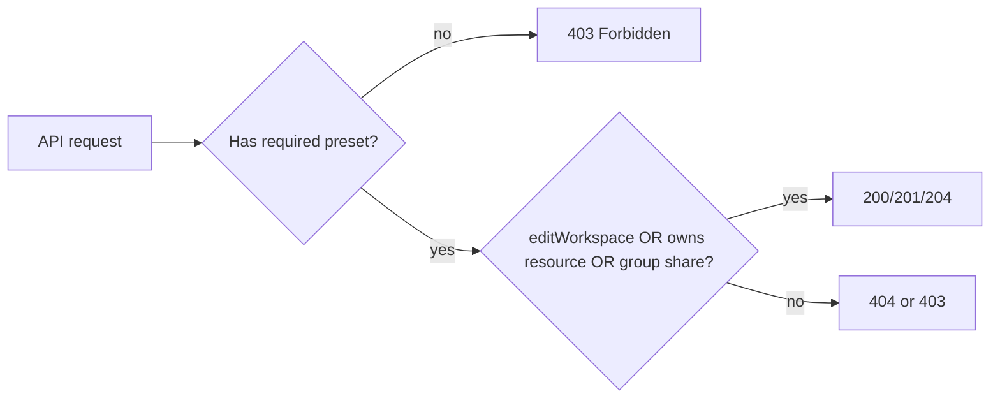

# Preset → endpoint mapping and API enforcement

## Your table is already the source of truth

The 11 rows you pasted match [Helpers/Roles-Functions.csv](Helpers/Roles-Functions.csv) and are registered in [`WorkspacePermissionPresets.cs`](EduCollab.Application/Models/WorkspacePermissionPresets.cs) (plus 7 editor UI rows). Role shortcuts derive from exact preset-set equality:

| Role | Presets granted (TRUE columns) |
|------|-------------------------------|
| **owner** | All 18 keys |
| **manager** | Everything except `editWorkspace` |
| **creator** | `addAssets`, `addScenes`, `addFlows`, `createSessions`, `loadAssets`, `loadScenes`, + editor keys |
| **viewer** | `loadScenes` only |

**Current gap:** presets are stored and returned on members, but services still authorize via [`WorkspaceRolePermissions`](EduCollab.Application/Models/WorkspaceRolePermissions.cs) on `membership.Role`. A `custom` member whose presets differ from a template gets wrong access today.

---

## Two-layer authorization model

Every workspace-scoped request should pass **both** checks:



- **Layer 1 (preset gate):** Can this user attempt this *type* of action?
- **Layer 2 (resource scope):** Can they reach *this specific* asset/scene/flow/group? Keep existing [`GroupAccessResolver`](EduCollab.Application/Services/Groups/GroupAccessResolver.cs) + [`WorkspaceContentVisibility`](EduCollab.Application/Services/Content/WorkspaceContentVisibility.cs) logic; only change the `canSeeAll` flag from role to `HasPreset("editWorkspace")`.

---

## Preset → endpoint mapping (Layer 1 gates)

Base path for workspace resources: `/api/workspace`.

### `editWorkspace` (owner only)

| Method | Path | Notes |
|--------|------|-------|
| PUT | `/api/workspace` | Update name/description |
| DELETE | `/api/workspace` | Archive workspace |
| PUT | `/api/workspace/thumbnail` | Upload thumbnail |
| DELETE | `/api/workspace/thumbnail` | Remove thumbnail |

Also grants **see-all-content bypass** (today's `CanSeeAllContent`) for assets/scenes/flows/groups listing.

**Not gated** (any workspace member): `GET /api/workspace`, `GET /api/workspace/thumbnail`.

### `seeGroupsTab` — client-only

No API gate. Frontend hides the Groups tab. Creators/viewers without this preset still reach groups they belong to via group membership on read endpoints.

### `addGroups` (owner, manager)

| Method | Path |
|--------|------|
| POST | `/api/workspace/groups` |
| PUT | `/api/workspace/groups/{groupId}` |
| DELETE | `/api/workspace/groups/{groupId}` |
| POST | `/api/workspace/groups/{groupId}/users` |
| DELETE | `/api/workspace/groups/{groupId}/users/{userId}` |

Group **read** endpoints stay membership-scoped (no `seeGroupsTab` gate):

- `GET /api/workspace/groups`, `/flat`, `/{groupId}`
- `GET /api/workspace/groups/{groupId}/assets|scenes|flows`
- `GET /api/workspace/groups/{groupId}/users`

### `seeUsersTab` — client-only (recommended)

No API gate in v1 (matches existing [workspace_invitation_presets plan](.cursor/plans/workspace_invitation_presets_506449b7.plan.md)). Frontend uses member `presets[]` to show/hide Users tab.

Optional hardening later: gate `GET /api/workspace/users` and `GET /api/workspace/users/{userId}` with `seeUsersTab`.

### `inviteUsers` (owner, manager)

| Method | Path |
|--------|------|
| POST | `/api/workspace/invitations` |
| PUT | `/api/workspace/users/{userId}` | Update member presets |

Related member ops (not in CSV; keep owner/manager behavior, migrate checks to presets):

- `DELETE /api/workspace/users/{userId}` — remove member (requires `inviteUsers` + existing hierarchy rules)

Subset rule on assign already exists in [`WorkspaceService.EnsureInviterCanAssignPresets`](EduCollab.Application/Services/Workspaces/WorkspaceService.cs).

### `addAssets` (owner, manager, creator)

| Method | Path |
|--------|------|
| POST | `/api/workspace/assets` |
| PUT | `/api/workspace/assets/{assetId}` |
| DELETE | `/api/workspace/assets/{assetId}` |
| PUT | `/api/workspace/assets/{assetId}/content` |
| POST/PUT/DELETE | `/api/workspace/asset-groups` | When managing shares for an asset you can edit |

**Scope (Layer 2):** without `editWorkspace`, user may only mutate **own** assets; with `addGroups` + `addAssets` (manager-like), also assets shared to accessible groups via `ContentGroupShareOperations.ManagerCanManageViaGroups`.

### `addScenes` (owner, manager, creator)

| Method | Path |
|--------|------|
| POST | `/api/workspace/scenes` |
| PUT | `/api/workspace/scenes/{sceneId}` |
| DELETE | `/api/workspace/scenes/{sceneId}` |
| POST/PUT/DELETE | `/api/workspace/scene-groups` |

**Scope:** same owner vs manager pattern as assets in [`SceneService`](EduCollab.Application/Services/Scenes/SceneService.cs).

### `addFlows` (owner, manager, creator)

| Method | Path |
|--------|------|
| POST | `/api/workspace/flows` |
| PUT | `/api/workspace/flows/{flowId}` |
| DELETE | `/api/workspace/flows/{flowId}` |
| POST/PUT/DELETE | `/api/workspace/flow-groups` |

### `createSessions` (owner, manager, creator)

**Not implemented yet.** Planned in [colyseus_api_integration plan](.cursor/plans/colyseus_api_integration_1348a171.plan.md):

- `POST /api/workspace/sessions`
- Related join-ticket/bootstrap endpoints when sessions ship

Add preset gate at implementation time.

### `loadAssets` (owner, manager, creator — **not viewer**)

| Method | Path |
|--------|------|
| GET | `/api/workspace/assets` |
| GET | `/api/workspace/assets/{assetId}` |
| GET | `/api/workspace/assets/{assetId}/content` |
| GET | `/api/workspace/groups/{groupId}/assets` |

**Important fix:** today viewers can read assets if group-shared ([`AssetService.GetAssetByIdAsync`](EduCollab.Application/Services/Assets/AssetService.cs) has no `loadAssets` gate). After migration, viewer → 403 on asset reads even when group membership would otherwise allow visibility.

### `loadScenes` (all roles, including viewer)

| Method | Path |
|--------|------|
| GET | `/api/workspace/scenes`, `/scenes/{sceneId}` |
| GET | `/api/workspace/flows`, `/flows/{flowId}` |
| GET | `/api/workspace/groups/{groupId}/scenes`, `/flows` |

Scene JSON inside a scene response counts as load; still subject to Layer 2 group visibility.

### Editor presets (`editorOutliner` … `editorTransformTools`) — client-only

No API gates. Frontend reads `presets[]` from member response / `GET /api/workspace/permission-presets`.

---

## Implementation plan

### 1. Add `WorkspacePresetPermissions`

New file: [`EduCollab.Application/Models/WorkspacePresetPermissions.cs`](EduCollab.Application/Models/WorkspacePresetPermissions.cs)

```csharp
public static bool HasPreset(WorkspaceMember member, string key);
public static bool HasAnyPreset(WorkspaceMember member, params string[] keys);
public static IReadOnlySet<string> ResolvePresets(WorkspaceMember member); // delegate to WorkspacePermissionPresets.ResolveMemberPresetKeys
```

Gate helpers (replace `WorkspaceRolePermissions`):

| Old | New |
|-----|-----|
| `CanManageWorkspace(role)` | `HasPreset(member, "editWorkspace")` |
| `CanInviteUsers(role)` | `HasPreset(member, "inviteUsers")` |
| `CanManageGroups(role)` | `HasPreset(member, "addGroups")` |
| `CanSeeAllContent(role)` | `HasPreset(member, "editWorkspace")` |
| `CanCrudAssets(role)` | `HasPreset(member, "addAssets")` |
| `IsReadOnly(role)` for scenes | `!HasPreset(member, "addScenes")` |
| `IsReadOnly(role)` for flows | `!HasPreset(member, "addFlows")` |
| *(missing today)* | `HasPreset(member, "loadAssets")` on asset GET |
| *(missing today)* | `HasPreset(member, "loadScenes")` on scene/flow GET |

Scope helper for manager-like asset/scene management:

```csharp
bool CanManageOthersContentViaGroups(WorkspaceMember member) =>
    HasPreset(member, "addGroups") && HasAnyPreset(member, "addAssets", "addScenes", "addFlows");
```

Replace `membership.Role == WorkspaceRole.Manager` in [`ContentGroupShareOperations.ManagerCanManageViaGroups`](EduCollab.Application/Services/Content/ContentGroupShareOperations.cs) with this preset check.

### 2. Refactor services (mechanical replacement)

Replace `WorkspaceRolePermissions.*(membership.Role)` with preset helpers in:

- [`WorkspaceService.cs`](EduCollab.Application/Services/Workspaces/WorkspaceService.cs) — invite, update, delete workspace; member update/remove guards
- [`WorkspaceThumbnailService.cs`](EduCollab.Application/Services/Workspaces/WorkspaceThumbnailService.cs)
- [`GroupService.cs`](EduCollab.Application/Services/Groups/GroupService.cs)
- [`AssetService.cs`](EduCollab.Application/Services/Assets/AssetService.cs) — add `loadAssets` gate on all read paths + content download
- [`SceneService.cs`](EduCollab.Application/Services/Scenes/SceneService.cs) — split read (`loadScenes`) vs write (`addScenes`) gates
- [`FlowService.cs`](EduCollab.Application/Services/Flows/FlowService.cs) — same pattern
- [`ContentGroupShareOperations.cs`](EduCollab.Application/Services/Content/ContentGroupShareOperations.cs)

**Member admin rules** in `WorkspaceService.RemoveWorkspaceMemberAsync` / `UpdateWorkspaceMemberAsync`: migrate actor checks from `actorMember.Role is Viewer or Creator` to `!HasPreset(actor, "inviteUsers")`, keeping owner-transfer and manager-hierarchy rules using derived role where necessary (sole owner cannot leave).

Leave [`WorkspaceRolePermissions`](EduCollab.Application/Models/WorkspaceRolePermissions.cs) as deprecated thin wrapper during transition, or delete once all call sites are migrated.

### 3. Tests

Extend/add tests to prove preset (not just role) drives access:

| Test | File |
|------|------|
| Custom member `{ loadScenes }` blocked from `GET /assets` | new integration test or extend [`SceneAssetAccessIntegrationTests.cs`](EduCollab.Api.Tests/Integration/SceneAssetAccessIntegrationTests.cs) |
| Custom `{ addAssets, loadScenes }` can POST asset but not invite | [`WorkspaceApiIntegrationTests.cs`](EduCollab.Api.Tests/Integration/WorkspaceApiIntegrationTests.cs) |
| Standard role templates behave identically to before (regression) | existing [`GroupServiceMembershipAuthorizationTests.cs`](EduCollab.Api.Tests/GroupServiceMembershipAuthorizationTests.cs), asset/scene tests |
| Unit tests for `WorkspacePresetPermissions` | new file alongside [`WorkspacePermissionPresetsTests.cs`](EduCollab.Api.Tests/WorkspacePermissionPresetsTests.cs) |

### 4. Out of scope (document only)

- `seeGroupsTab`, `seeUsersTab`, editor presets — client enforcement via `presets[]` on member responses
- `createSessions` — gate when SessionsController is built
- Platform admin routes (`/api/admin/*`) — separate auth, not workspace presets

---

## Role → callable endpoints (quick reference)

After enforcement, a member can call endpoints whose **required preset** is in their assigned set (plus Layer 2 group scope where applicable):

| Endpoint category | owner | manager | creator | viewer |
|-------------------|:-----:|:-------:|:-------:|:------:|
| Edit workspace | yes | no | no | no |
| Manage groups | yes | yes | no* | no |
| Invite / update members | yes | yes | no | no |
| Create/edit assets | yes | yes† | yes‡ | no |
| Create/edit scenes/flows | yes | yes† | yes‡ | no |
| Load assets | yes | yes | yes | **no** |
| Load scenes/flows | yes | yes | yes | yes |
| Create sessions (future) | yes | yes | yes | no |

\*Creators access groups only as members, not via `addGroups`.  
†Manager scope includes group-shared content they can access.  
‡Creator scope is own content + group placement in member groups.
