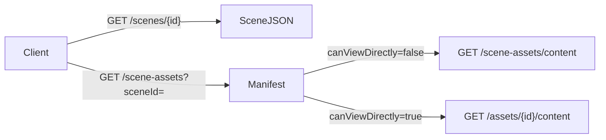
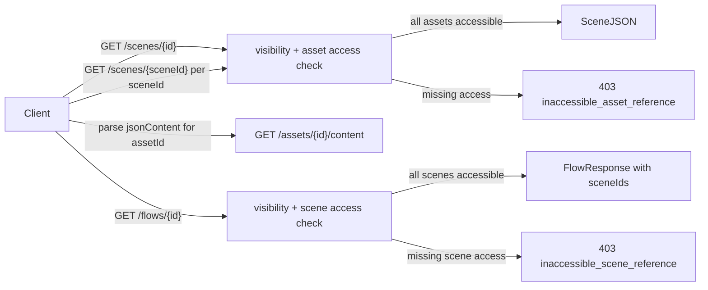

# Remove Manifest APIs and Enforce Direct Asset Access

## Current state

The API uses a **two-phase manifest model**:



Flows mirror this with `GET /flow-scenes` and `GET /flow-scenes/content`.

This allows cross-group **contextual access** (e.g. a viewer can download a hidden asset via scene context — proven in [`SceneAssetsIntegrationTests.cs`](EduCollab.Api.Tests/Integration/SceneAssetsIntegrationTests.cs)).

## Target state



- **No manifest endpoints** — remove [`SceneAssetsController.cs`](EduCollab.Api/Controllers/SceneAssetsController.cs) and [`FlowScenesController.cs`](EduCollab.Api/Controllers/FlowScenesController.cs) entirely.
- **No contextual bypass** — asset content only via `GET /assets/{id}/content`.
- **Client discovers references** — clients parse `jsonContent` (scene JSON) to find `assetId` values and `sceneIds` (on flow response) to know which scenes to load. The server does not expose a resolved reference list.
- **Errors on read** — scene GET fails with 403 when a JSON-referenced asset is inaccessible; flow GET fails with 403 when an attached scene is inaccessible. Asset access within flow scenes is validated when each scene is loaded individually.

---

## 1. Remove manifest API surface

**Delete controllers and routes**

- Delete [`SceneAssetsController.cs`](EduCollab.Api/Controllers/SceneAssetsController.cs), [`FlowScenesController.cs`](EduCollab.Api/Controllers/FlowScenesController.cs)
- Remove `SceneAssets` and `FlowScenes` from [`ApiEndpoints.cs`](EduCollab.Api/ApiEndpoints.cs)

**Delete contracts / models no longer needed**

| Remove | Keep (internal) |
|--------|-----------------|
| `SceneAssetResponse`, `SceneAssetsResponse`, `AttachSceneAssetRequest` | — |
| `FlowSceneResponse`, `FlowScenesResponse`, `AttachFlowSceneRequest` | — |
| `SceneAssetContextItem`, `FlowSceneContextItem` | `FlowSceneLink` (junction, used internally) |
| `SceneAssetLink` usage in services | DB tables left as-is (no migration) |

**Clean up service interfaces**

Remove from [`ISceneService.cs`](EduCollab.Application/Services/Scenes/ISceneService.cs) / [`IFlowService`](EduCollab.Application/Services/Flows/FlowService.cs):

- `GetSceneAssetsAsync`, `AttachSceneAssetAsync`, `DetachSceneAssetAsync`, `GetSceneAssetContentAsync`
- `GetFlowScenesAsync`, `AttachFlowSceneAsync`, `DetachFlowSceneAsync`, `GetFlowSceneContentAsync`

Remove related methods from [`SceneService.cs`](EduCollab.Application/Services/Scenes/SceneService.cs), [`SceneRepository`](EduCollab.Infrastructure/Repositories/SceneRepository.cs) (`GetSceneAssetLinksAsync`, `CreateSceneAssetLinkAsync`, `DeleteSceneAssetLinkAsync`), mapping in [`ContractMapping.cs`](EduCollab.Api/Mapping/ContractMapping.cs), sort profiles in [`ResourceSortProfiles.cs`](EduCollab.Api/Query/ResourceSortProfiles.cs).

Scene asset references come **only from JSON `assetId` properties** (via existing [`SceneJsonAssetReferenceParser`](EduCollab.Application/Services/Scenes/SceneJsonAssetReferenceParser.cs)) — used server-side for validation only, not returned as a manifest.

---

## 2. Move flow scenes into Flow CRUD

Add `sceneIds` to flow contracts:

- [`CreateFlowRequest.cs`](EduCollab.Contracts/Requests/Flows/CreateFlowRequest.cs) — optional `List<int>? SceneIds`
- [`UpdateFlowRequest.cs`](EduCollab.Contracts/Requests/Flows/UpdateFlowRequest.cs) — optional `List<int>? SceneIds` (replace semantics when provided)
- [`FlowResponse.cs`](EduCollab.Contracts/Responses/Flows/FlowResponse.cs) — `List<int> SceneIds`
- [`Flow.cs`](EduCollab.Application/Models/Flow.cs) — `List<int> SceneIds` (populated from `FlowScenes` junction)

**[`FlowService`](EduCollab.Application/Services/Flows/FlowService.cs) changes:**

- `CreateFlowAsync(flow, groupIds, sceneIds, ...)` — after creating flow, write `FlowSceneLink` rows via existing [`FlowRepository`](EduCollab.Infrastructure/Repositories/FlowRepository.cs) methods
- `UpdateFlowAsync` — when `sceneIds` provided, replace junction rows
- `GetFlowByIdAsync` — populate `flow.SceneIds` from junction; validate scene access only (see below)
- Wire through [`FlowsController`](EduCollab.Api/Controllers/FlowsController.cs) and [`ContractMapping`](EduCollab.Api/Mapping/ContractMapping.cs)

---

## 3. Access validation (inline per service, no shared helper)

### New exceptions

Add to [`EduCollab.Application/Exceptions`](EduCollab.Application/Exceptions):

```csharp
// InaccessibleAssetReferenceException
// References: IReadOnlyList<InaccessibleAssetReference>  (assetId + reason)
// HTTP 403, error: inaccessible_asset_reference

// InaccessibleSceneReferenceException
// References: IReadOnlyList<InaccessibleSceneReference>  (sceneId + reason)
// HTTP 403, error: inaccessible_scene_reference
```

Register in [`ApiExceptionHandler.cs`](EduCollab.Api/ExceptionHandlers/ApiExceptionHandler.cs) with ProblemDetails extensions mirroring the existing `invalidAssetReferences` pattern.

**Reason strings (examples):**

- Asset not in workspace: `"Asset was not found in this workspace."`
- Asset exists but hidden: `"You do not have access to this asset."`
- Scene not in workspace: `"Scene was not found in this workspace."`
- Scene exists but hidden: `"You do not have access to this scene."`

### SceneService — inline asset validation

Extend existing `EnsureValidSceneAssetReferencesAsync` in [`SceneService.cs`](EduCollab.Application/Services/Scenes/SceneService.cs) to check both existence and caller visibility (`WorkspaceContentVisibility.IsAssetVisibleToUser`). Use `SceneJsonAssetReferenceParser` to extract IDs from JSON.

Call from:

- `GetSceneByIdAsync` — after scene visibility check, before returning JSON
- `CreateSceneAsync` / `UpdateSceneAsync` — on write (existence + caller access)

Throw `InaccessibleAssetReferenceException` when any referenced asset is missing or inaccessible.

### FlowService — inline scene validation only

Add private validation in [`FlowService.cs`](EduCollab.Application/Services/Flows/FlowService.cs) that checks each `sceneId` exists in workspace and is visible to the caller (`WorkspaceContentVisibility.IsSceneVisibleToUser`). **Do not** traverse into scene JSON or validate nested assets — that happens when the client loads each scene via `GET /scenes/{id}`.

Call from:

- `GetFlowByIdAsync` — after flow visibility check
- `CreateFlowAsync` / `UpdateFlowAsync` — when `sceneIds` provided

Throw `InaccessibleSceneReferenceException` when any attached scene is missing or inaccessible.

### When validation runs

| Operation | Server checks |
|-----------|---------------|
| `GET /scenes/{id}` | Scene visible + all JSON `assetId` refs accessible |
| `POST/PUT /scenes` | All JSON `assetId` refs exist + caller can access |
| `GET /flows/{id}` | Flow visible + all `sceneIds` accessible |
| `POST/PUT /flows` | All `sceneIds` exist + caller can access |
| `GET /assets/{id}/content` | Direct asset visibility (unchanged, 404 if hidden) |

Invisible parent resource → keep existing **404** behavior (no information leak).

---

## 4. Tests

| File | Action |
|------|--------|
| [`SceneAssetsIntegrationTests.cs`](EduCollab.Api.Tests/Integration/SceneAssetsIntegrationTests.cs) | Rewrite → `SceneAssetAccessIntegrationTests`: member with shared scene + hidden asset gets **403** on `GET /scenes/{id}` with `inaccessibleAssetReferences`; direct `GET /assets/{hiddenId}` still 404 |
| [`SceneAssetsControllerEndpointTests.cs`](EduCollab.Api.Tests/SceneAssetsControllerEndpointTests.cs) | Delete |
| [`FlowScenesControllerEndpointTests.cs`](EduCollab.Api.Tests/FlowScenesControllerEndpointTests.cs) | Delete; add flow scene access tests to [`FlowsControllerEndpointTests.cs`](EduCollab.Api.Tests/FlowsControllerEndpointTests.cs) |
| [`FakeSceneService.cs`](EduCollab.Api.Tests/Fakes/FakeSceneService.cs), [`FakeFlowService.cs`](EduCollab.Api.Tests/Fakes/FakeFlowService.cs) | Remove deleted interface methods |
| New flow integration test | Create flow with `sceneIds` via POST; member without scene access gets 403 on GET flow |

---

## 5. Documentation and OpenAPI

Update [`OpenApiContractDescriptions.cs`](EduCollab.Api/Swagger/OpenApiContractDescriptions.cs):

- Remove "Scene runtime asset loading" and "Flow runtime scene loading" manifest sections
- Document client workflow: parse `jsonContent` for `assetId` values; use `sceneIds` from flow response to load scenes; download assets via `GET /assets/{id}/content`
- Document `sceneIds` on flow create/update/response
- Document `inaccessible_asset_reference` and `inaccessible_scene_reference` error codes

Regenerate [`openapi/v1/openapi.json`](openapi/v1/openapi.json) and update [`EduCollab.Api.postman_collection.json`](EduCollab.Api.postman_collection.json).

---

## 6. Downstream impact

The Colyseus integration plan ([`.cursor/plans/colyseus_api_integration_1348a171.plan.md`](.cursor/plans/colyseus_api_integration_1348a171.plan.md)) references bootstrap manifests and `includeAssets` overrides. After this change, session bootstrap should load scenes/flows directly and rely on the same access checks — update that plan separately when implementing sessions.

---

## Client workflow after change

**Scene:**

1. `GET /api/workspace/scenes/{sceneId}` — returns `jsonContent` or 403 if any referenced asset is inaccessible
2. Client parses `jsonContent` for `assetId` properties
3. `GET /api/workspace/assets/{assetId}/content` for each discovered ID

**Flow:**

1. `GET /api/workspace/flows/{flowId}` — returns metadata + `sceneIds` or 403 if any attached scene is inaccessible
2. `GET /api/workspace/scenes/{sceneId}` per `sceneId` (each scene validates its own assets)
3. Client parses each scene's `jsonContent` for `assetId` values and downloads assets as above
