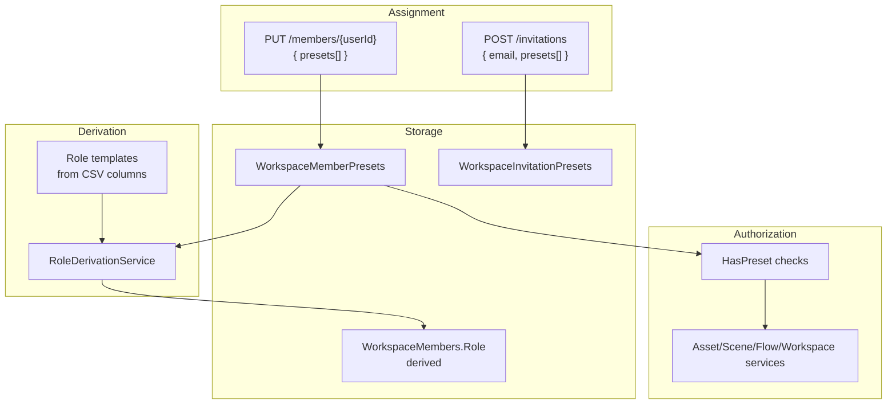
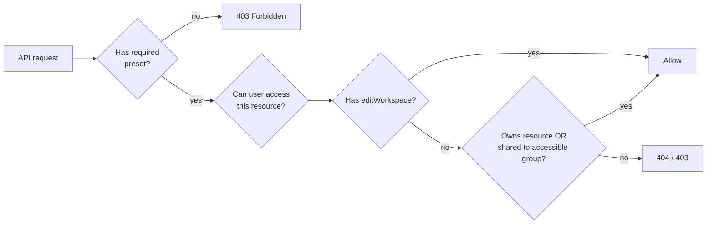
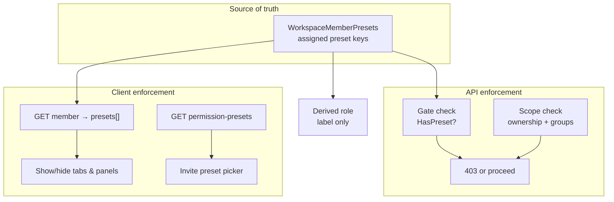

# Workspace invitation presets plan (revised)

## Goal

Change the permission model so that:

1. **Each CSV row** in [Helpers/Roles-Functions.csv](Helpers/Roles-Functions.csv) is one **preset** (18 total).
2. **Users are assigned a list of presets** on invite and member update — not a role directly.
3. **Roles are derived** by comparing the assigned preset set to the four standard templates (`owner`, `manager`, `creator`, `viewer`). If no template matches exactly, the derived role is **`custom`**.
4. **Effective permissions** come from the assigned presets. Role is a label for UI and backward compatibility; `custom` members keep exactly the presets they were given.



## Conceptual model

### Row-presets (what you assign)

| CSV row | Preset key (API) |
|---------|------------------|
| edit workspace | `editWorkspace` |
| see groups tab | `seeGroupsTab` |
| add groups | `addGroups` |
| see users tab | `seeUsersTab` |
| invite users | `inviteUsers` |
| add assets | `addAssets` |
| add scenes | `addScenes` |
| add flows | `addFlows` |
| create sessions | `createSessions` |
| load assets | `loadAssets` |
| load scenes | `loadScenes` |
| editor / outliner panel | `editorOutliner` |
| editor / sequencer panel | `editorSequencer` |
| editor / actions panel | `editorActions` |
| editor / details panel | `editorDetails` |
| editor / console panel | `editorConsole` |
| editor / catalog panel | `editorCatalog` |
| editor / UI editor | `editorUi` |
| editor / transform tools | `editorTransformTools` |

### Role templates (derived, not assigned)

The four CSV **columns** define standard role bundles. A member's role is:

| Condition | Derived role |
|-----------|--------------|
| Assigned presets **exactly equal** owner column TRUE set | `owner` |
| Assigned presets **exactly equal** manager column TRUE set | `manager` |
| Assigned presets **exactly equal** creator column TRUE set | `creator` |
| Assigned presets **exactly equal** viewer column TRUE set | `viewer` |
| Anything else | `custom` |

`custom` is a first-class derived role. Permissions for `custom` members are **only** what their assigned presets grant — no implicit extras.

### UI role shortcuts (client-side, optional)

The catalog endpoint exposes role templates so the frontend can offer "Creator" / "Manager" shortcuts that **pre-fill** the preset checklist. The API still receives `presets[]`; it does not accept a role on write.

---

## Current state (what changes)

Today members and invitations store a single `Role` string ([`WorkspaceMembers.Role`](EduCollab.Infrastructure/Database/DbInitializer.cs), [`WorkspaceInvitations.Role`](EduCollab.Infrastructure/Database/DbInitializer.cs)). Authorization uses [`WorkspaceRolePermissions`](EduCollab.Application/Models/WorkspaceRolePermissions.cs) against that enum in services like [`WorkspaceService`](EduCollab.Application/Services/Workspaces/WorkspaceService.cs), [`AssetService`](EduCollab.Application/Services/Assets/AssetService.cs), [`SceneService`](EduCollab.Application/Services/Scenes/SceneService.cs).

This plan makes **presets the source of truth** and keeps `WorkspaceMembers.Role` as a **cached derived label** for sorting, display, and gradual migration of auth checks.

---

## 1. Preset registry (application layer)

New file: [`EduCollab.Application/Models/WorkspacePermissionPresets.cs`](EduCollab.Application/Models/WorkspacePermissionPresets.cs)

Responsibilities:

- Define all 18 preset keys + display labels (from CSV row text).
- Define 4 role templates as `IReadOnlySet<string>` preset keys.
- `bool IsValidPreset(string key)`
- `IReadOnlySet<string> GetRoleTemplate(WorkspaceRole role)` for owner/manager/creator/viewer
- `WorkspaceRole DeriveRole(IReadOnlySet<string> assignedPresets)` → Owner | Manager | Creator | Viewer | **Custom**
- Unit test reads [Helpers/Roles-Functions.csv](Helpers/Roles-Functions.csv) and asserts registry parity.

Extend [`WorkspaceRole`](EduCollab.Application/Models/WorkspaceRole.cs):

```csharp
public enum WorkspaceRole
{
    Owner = 0,
    Manager = 1,
    Creator = 2,
    Viewer = 3,
    Custom = 4,  // new
}
```

Update [`WorkspaceRoleExtensions`](EduCollab.Application/Models/WorkspaceRoleExtensions.cs) for persistence of `Custom`.

---

## 2. Database schema

### New table: `WorkspaceMemberPresets`

```sql
CREATE TABLE WorkspaceMemberPresets (
    WorkspaceId INT NOT NULL REFERENCES Workspaces(Id) ON DELETE CASCADE,
    UserId      INT NOT NULL REFERENCES Users(Id) ON DELETE CASCADE,
    PresetKey   VARCHAR(64) NOT NULL,
    PRIMARY KEY (WorkspaceId, UserId, PresetKey)
);
CREATE INDEX IX_WorkspaceMemberPresets_WorkspaceUser
    ON WorkspaceMemberPresets (WorkspaceId, UserId);
```

### New table: `WorkspaceInvitationPresets`

Pending invitations also store presets (not a single role):

```sql
CREATE TABLE WorkspaceInvitationPresets (
    InvitationId BIGINT NOT NULL REFERENCES WorkspaceInvitations(Id) ON DELETE CASCADE,
    PresetKey    VARCHAR(64) NOT NULL,
    PRIMARY KEY (InvitationId, PresetKey)
);
```

Keep `WorkspaceInvitations.Role` temporarily: write derived role on insert for debugging/backfill; long-term it is redundant with presets + derivation.

### Backfill migration (in `DbInitializer`)

For each existing `WorkspaceMembers` row, expand current `Role` into preset rows using role templates, then re-derive role (should match except edge legacy values).

---

## 3. Role derivation service

New: [`EduCollab.Application/Services/Workspaces/RoleDerivationService.cs`](EduCollab.Application/Services/Workspaces/RoleDerivationService.cs)

```csharp
public WorkspaceRole DeriveRole(IReadOnlySet<string> presets);
public bool IsStandardRole(WorkspaceRole role) => role != WorkspaceRole.Custom;
```

Called whenever presets are assigned (invite accept, member update, backfill).

---

## 4. Permission control (how enforcement works)

### Core principle: presets authorize actions, groups grant resource access

Two independent axes work together on every request:

| Axis | Question it answers | Source |
|------|---------------------|--------|
| **Presets** | *"Is this user allowed to perform this type of action?"* | `WorkspaceMemberPresets` |
| **Groups** | *"Which specific resources can this user reach?"* | Group membership + `AssetGroupShares` / folder shares |



**Example:** A user with `loadScenes` but not in any group that a scene is shared to → preset passes, resource access fails → they cannot open that scene. A user with `addAssets` can create assets (preset), but can only edit assets they own or that are shared to their groups (resource scope).

**Only exception:** `editWorkspace` preset bypasses group filtering for visibility (see all workspace content), same as today's Owner.

Permissions are controlled in **two places**, with presets as the workspace-level source of truth:



### Source of truth

| Stored | Used for |
|--------|----------|
| `WorkspaceMemberPresets` rows | **All permission decisions** |
| `WorkspaceMembers.Role` (derived) | Display, sorting, filters — **not** for granting access |
| Derived `custom` role | Label only; no implicit permissions beyond assigned presets |

Every authorized request loads the caller's `WorkspaceMember` **with presets attached**. Services call `WorkspacePresetPermissions` instead of `WorkspaceRolePermissions`.

New helper: [`EduCollab.Application/Models/WorkspacePresetPermissions.cs`](EduCollab.Application/Models/WorkspacePresetPermissions.cs)

```csharp
public static bool HasPreset(WorkspaceMember member, string key);
public static bool HasAnyPreset(WorkspaceMember member, params string[] keys);
```

### Layer 1 — Gate checks (can you attempt this action?)

Direct 1:1 mapping from CSV row-presets to API operations. If the preset is missing → `403 AccessDenied`.

| Preset key | API operations gated |
|------------|----------------------|
| `editWorkspace` | `PUT /workspace`, workspace thumbnail upload/delete, archive |
| `seeGroupsTab` | *(client only — no API gate)* |
| `addGroups` | `POST/PUT/DELETE /groups` |
| `seeUsersTab` | *(client only)* |
| `inviteUsers` | `POST /invitations`, `PUT /members/{id}` (preset assignment) |
| `addAssets` | `POST /assets`, asset update/delete when scope allows |
| `addScenes` | `POST /scenes`, scene update/delete when scope allows |
| `addFlows` | `POST /flows`, flow update/delete when scope allows |
| `createSessions` | future `POST /sessions` |
| `loadAssets` | asset read/download endpoints |
| `loadScenes` | scene/flow read endpoints |
| `editorOutliner` … `editorTransformTools` | *(client only — editor UI panels)* |

Replaces today's [`WorkspaceRolePermissions`](EduCollab.Application/Models/WorkspaceRolePermissions.cs):

| Old role check | New preset gate |
|----------------|-----------------|
| `CanManageWorkspace` | `HasPreset("editWorkspace")` |
| `CanInviteUsers` | `HasPreset("inviteUsers")` |
| `CanManageGroups` | `HasPreset("addGroups")` |
| `CanCrudAssets` | `HasAnyPreset("addAssets","addScenes","addFlows")` per resource type |
| `CanSeeAllContent` | `HasPreset("editWorkspace")` |
| `IsReadOnly` | no `addAssets`/`addScenes`/`addFlows` presets |

### Layer 2 — Scope checks (which resources can you touch?)

The CSV does not define per-resource edit scope. Keep existing **ownership + group-share** logic from [`AssetService`](EduCollab.Application/Services/Assets/AssetService.cs), [`SceneService`](EduCollab.Application/Services/Scenes/SceneService.cs), etc., but branch on **presets** instead of role enum:

| Situation | Scope rule |
|-----------|------------|
| Has `editWorkspace` | Full workspace access (same as today's Owner) |
| Has `addAssets` but not `editWorkspace` | Create assets; edit/delete **own** assets only (today's Creator behavior) |
| Has `addGroups` + `addAssets` (manager-like) | Above + manage assets/scenes shared to groups the user can access (today's Manager via `ContentGroupShareOperations`) |
| Has only `loadScenes` / `loadAssets` | Read-only; visibility filtered by group membership (today's Viewer) |
| **`custom` combination** | Apply the matching row above per domain — e.g. `addAssets` without `addGroups` → Creator-scoped asset rules; `inviteUsers` without `addGroups` → can invite but not manage groups |

This means a `custom` member with `{ addAssets, loadScenes }` can create and load their own content but cannot invite users or edit the workspace — even though their derived role is `custom`, not `creator`.

### Layer 3 — Client/UI enforcement

Presets with no API gate (`seeGroupsTab`, `seeUsersTab`, editor panels) are enforced **only on the client**:

1. `GET /api/workspace/members/{userId}` (or current-user member) returns `presets[]`.
2. Frontend shows/hides tabs and panels based on that list.
3. API remains the real security boundary for data mutations; UI hiding is UX only.

### Layer 4 — Group sharing (resource access, unchanged)

Workspace presets authorize **actions**; groups determine **which resources** those actions apply to.

A user needs **both**:

1. **Preset** — e.g. `loadScenes` to call read endpoints at all.
2. **Group access** — membership in (or inheritance from) a group the resource is shared to, **or** ownership of the resource.

[`GroupAccessResolver.GetEffectiveAccessibleGroupIdsAsync`](EduCollab.Application/Services/Groups/GroupAccessResolver.cs) and [`WorkspaceContentVisibility`](EduCollab.Application/Services/Content/) (`IsAssetVisibleToUser`, `IsSceneVisibleToUser`, etc.) stay responsible for this layer. Only the `canSeeAll` flag switches from role-based to `HasPreset("editWorkspace")`.

### Assigning presets (invite/update guard)

Separate from runtime permission checks:

1. Actor must have `inviteUsers` preset.
2. Actor can only grant presets they themselves hold (**subset rule**).
3. Cannot strip `editWorkspace` from the sole workspace owner.

### Member loading

Extend [`WorkspaceMember`](EduCollab.Application/Models/WorkspaceMember.cs):

```csharp
public IReadOnlySet<string> Presets { get; set; } = Empty;
public WorkspaceRole Role { get; set; }  // derived label, not used for gates
```

Repository loads presets with every member fetch in [`WorkspaceRepository`](EduCollab.Infrastructure/Repositories/WorkspaceRepository.cs).

### Service refactor

Replace all `WorkspaceRolePermissions.*(membership.Role)` and `membership.Role == WorkspaceRole.Creator` branches with `WorkspacePresetPermissions` gate + scope helpers. Deprecate [`WorkspaceRolePermissions`](EduCollab.Application/Models/WorkspaceRolePermissions.cs) once migrated (or make it a thin wrapper over preset checks for standard templates during transition).

**Invariant:** For members whose derived role is `owner`/`manager`/`creator`/`viewer`, behavior must remain identical to today because their preset set equals the role template.

---

## 5. Invite / update authorization rules

Replace `EnsureInviterCanAssignRole` with `EnsureInviterCanAssignPresets`:

1. Inviter must have `inviteUsers` preset.
2. Inviter cannot grant a preset they do not hold (subset rule). Workspace owner template includes all presets, so owners can assign anything.
3. Cannot remove `editWorkspace` from the sole owner (existing owner-demotion guard adapted to presets).
4. Validate all requested preset keys exist in registry.
5. Reject empty preset list (at minimum `loadScenes` or explicit product default).

Member update: same subset rule; actor needs `inviteUsers` or a new `manageUsers` preset — use `seeUsersTab` + `inviteUsers` or just `inviteUsers` per CSV (managers have `inviteUsers`).

---

## 6. API contract changes

### `GET /api/workspace/permission-presets`

Returns:

```json
{
  "presets": [
    { "key": "addAssets", "label": "Add assets" }
  ],
  "roleTemplates": [
    {
      "role": "creator",
      "presets": ["addAssets", "addScenes", "..."]
    }
  ]
}
```

Auth: workspace member (for invite UI context).

### `POST /api/workspace/invitations`

**Breaking change** — replace `role` with `presets`:

```json
{
  "email": "user@example.com",
  "presets": ["addAssets", "addScenes", "loadScenes", "editorOutliner"]
}
```

### `PUT /api/workspace/members/{userId}`

```json
{
  "presets": ["loadScenes"]
}
```

### `WorkspaceMemberResponse`

```json
{
  "userId": 42,
  "presets": ["addAssets", "loadScenes"],
  "role": "custom",
  "joinedAt": "2026-07-06T08:00:00Z"
}
```

- `presets` — assigned preset keys (sorted)
- `role` — derived: `owner` | `manager` | `creator` | `viewer` | `custom`
- Remove direct `role` assignment from request bodies

### Files to change

- [`InviteUserRequest`](EduCollab.Contracts/Requests/Users/InviteUserRequest.cs) — `List<string> Presets`
- [`UpdateWorkspaceMemberRequest`](EduCollab.Contracts/Requests/Workspaces/UpdateWorkspaceMemberRequest.cs) — `List<string> Presets`
- [`WorkspaceMemberResponse`](EduCollab.Contracts/Responses/Workspaces/WorkspaceMemberResponse.cs) — add `presets`, keep `role` as derived
- [`WorkspacesController`](EduCollab.Api/Controllers/WorkspacesController.cs) — validation + catalog action
- [`ContractMapping`](EduCollab.Api/Mapping/ContractMapping.cs)
- [`IWorkspaceRepository`](EduCollab.Application/Repositories/IWorkspaceRepository.cs) / [`WorkspaceRepository`](EduCollab.Infrastructure/Repositories/WorkspaceRepository.cs) — preset CRUD
- [`WorkspaceInvitationDetails`](EduCollab.Application/Models/WorkspaceInvitationDetails.cs) — carry preset set instead of single role

---

## 7. Invitation accept flow

On accept/join ([`AcceptWorkspaceInvitationForExistingUserAsync`](EduCollab.Infrastructure/Repositories/WorkspaceRepository.cs)):

1. Read invitation presets from `WorkspaceInvitationPresets`.
2. Insert into `WorkspaceMemberPresets`.
3. Derive role → write `WorkspaceMembers.Role`.
4. Return member with presets + derived role.

---

## 8. Tests and docs

- **Registry test:** CSV parity for 18 presets × 4 role columns.
- **Derivation test:** exact template → role; partial overlap → `custom`.
- **Invite test:** assign custom preset combo → member has `role: "custom"` and exact presets.
- **Authorization test:** manager cannot assign `editWorkspace` preset; inviter without `inviteUsers` blocked.
- **Backfill test:** existing Owner member gets full owner preset set.
- Update [`openapi/v1/openapi.json`](openapi/v1/openapi.json), Postman collection, integration tests in [`EduCollab.Api.Tests`](EduCollab.Api.Tests/).

---

## Out of scope

- Workspace-defined custom presets beyond the 18 CSV rows.
- Changing group-level roles/shares (workspace presets only).
- Frontend implementation (API provides catalog + role templates for shortcuts).

## Migration note for API consumers

Breaking change:

- Send `presets: string[]` instead of `role: string` on invite and member update.
- Read `presets` + derived `role` from member responses.
- Use `GET /permission-presets` to build UI; role templates are hints only, not API input.

Existing DB roles are backfilled into preset rows automatically on deploy.
