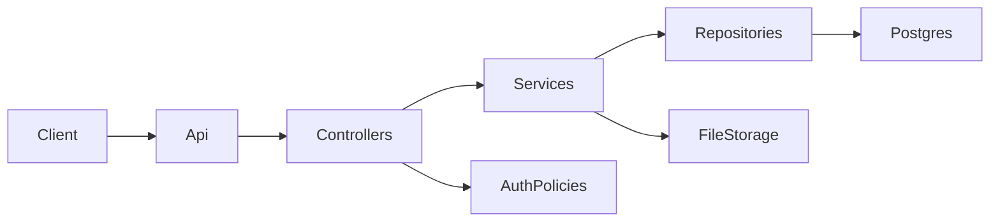
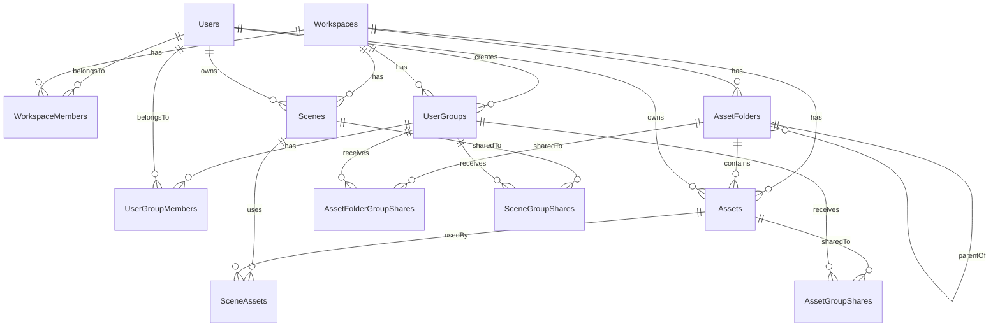

---

name: Educollab Api Plan
overview: Plan the `EduCollab.Api` architecture and first-version endpoint surface for an education collaboration platform built around Unity scenes and smart 3D assets. Adapt proven patterns from `AssetManagement.API` while focusing v1 on auth/users, workspaces as tenant boundaries, user groups, and collaborative scene/asset flows.
todos:

- id: confirm-foundation
content: Adopt controller-based architecture, JWT auth, Swagger, exception handling, and health checks based on the AssetManagement template, without API versioning for v1.
status: pending
- id: design-auth-users
content: Define the full auth and user management contract, persistence fields, and controller/service/repository flow for `Users`.
status: pending
- id: design-workspace-model
content: Model workspace tenancy, membership, user groups, and group-based sharing rules with workspace-scoped authorization.
status: pending
- id: design-scenes-assets
content: Define the scene JSON model, asset library tree, ownership model, contextual asset visibility, and endpoint surface within a workspace.
status: pending
- id: design-sharing-access
content: Specify how users discover and access scenes and assets through user groups while preserving user ownership and scene-scoped asset visibility.
status: pending
isProject: false

---

# EduCollab.Api Architecture And Endpoint Plan

## Product Framing

Think of `EduCollab.Api` as the backend for an education collaboration app where teachers, students, and teams work with Unity-based scenes and smart 3D learning assets.

Core product language:

- `Workspace` = school, institution, tenant, or customer space
- `UserGroup` = class, team, subject group, or collaboration group
- `AssetFolder` = organized smart asset library for Unity content
- `Asset` = reusable smart 3D learning asset, model, prefab, or metadata-driven resource
- `Scene` = standalone Unity scene definition stored as JSON
- `SceneAssets` = which smart assets are used inside a scene

This framing keeps the API oriented toward educational collaboration instead of sounding like a generic file-sharing backend.

## Recommended Direction

Use `AssetManagement.API` as a structural template for the host layer, not as a full domain template. Keep the current three-project split:

- API host: `[C:\Users\janat\Desktop\EduCollab.Api\EduCollab.Api\Program.cs](C:\Users\janat\Desktop\EduCollab.Api\EduCollab.Api\Program.cs)`
- Application/business layer: `[C:\Users\janat\Desktop\EduCollab.Api\EduCollab.Application\ApplicationServiceCollectionExtensions.cs](C:\Users\janat\Desktop\EduCollab.Api\EduCollab.Application\ApplicationServiceCollectionExtensions.cs)`
- API contracts: `[C:\Users\janat\Desktop\EduCollab.Api\EduCollab.Contracts](C:\Users\janat\Desktop\EduCollab.Api\EduCollab.Contracts)`

Mirror these template patterns from `AssetManagement.API`:

- Central composition in `[C:\Users\janat\Desktop\tfs\AssetManagement.API\Source\AssetManagement.API\Program.cs](C:\Users\janat\Desktop\tfs\AssetManagement.API\Source\AssetManagement.API\Program.cs)`
- Controller organization and action style like `[C:\Users\janat\Desktop\tfs\AssetManagement.API\Source\AssetManagement.API\Controllers\V1\UsersController.cs](C:\Users\janat\Desktop\tfs\AssetManagement.API\Source\AssetManagement.API\Controllers\V1\UsersController.cs)`
- Swagger setup and composition patterns from `[C:\Users\janat\Desktop\tfs\AssetManagement.API\Source\AssetManagement.API\Swagger\ConfigureSwaggerOptions.cs](C:\Users\janat\Desktop\tfs\AssetManagement.API\Source\AssetManagement.API\Swagger\ConfigureSwaggerOptions.cs)`
- Reusable authorization operations from `[C:\Users\janat\Desktop\tfs\AssetManagement.API\Source\AssetManagement.API\Authorization\Operations.cs](C:\Users\janat\Desktop\tfs\AssetManagement.API\Source\AssetManagement.API\Authorization\Operations.cs)`

Do not copy the template’s full EF/Identity complexity yet. `EduCollab.Api` is still early-stage and currently uses Dapper plus a lightweight startup initializer in `[C:\Users\janat\Desktop\EduCollab.Api\EduCollab.Application\Database\DbInitializer.cs](C:\Users\janat\Desktop\EduCollab.Api\EduCollab.Application\Database\DbInitializer.cs)`, so the first architecture pass should stay incremental.

## Target Architecture

Adopt a layered, feature-oriented design inside the existing solution:

- `EduCollab.Api`
  - `Controllers/` for REST controllers grouped by feature
  - `Middleware/` or `ExceptionHandlers/` for API-wide errors
  - `Authorization/` for policies/handlers
  - `Swagger/` for OpenAPI setup
  - `Config/` for options classes
- `EduCollab.Application`
  - `Services/<Feature>/` for use-case orchestration
  - `Repositories/<Feature>/` for data access abstractions and Dapper implementations
  - `Models/<Feature>/` for domain entities
  - `Database/` for connection factory, schema init or migrations
- `EduCollab.Contracts`
  - `Requests/<Feature>/`
  - `Responses/<Feature>/`

Prefer feature folders over one giant `Services` or `Models` folder. That keeps the code readable while still matching the template’s controller/service flow.




## Cross-Cutting Foundations To Plan First

Following the template, establish these platform concerns before expanding endpoints:

- Swagger/OpenAPI for the current API surface.
- JWT authentication and authorization fallback policy.
- Central exception handling with consistent error responses.
- Options-based configuration for database, JWT, and asset storage.
- Health endpoint such as `/_health`.
- Request validation using DTO annotations first; add FluentValidation only if complexity grows.

For `EduCollab.Api`, the best sequence is:

1. Finish auth basics around the existing user contracts in `[C:\Users\janat\Desktop\EduCollab.Api\EduCollab.Contracts\Requests](C:\Users\janat\Desktop\EduCollab.Api\EduCollab.Contracts\Requests)`.
2. Introduce `Workspaces` as the tenant boundary so all access checks have a clear scope.
3. Introduce `UserGroups` inside each workspace as the main collaboration boundary.
4. Model `Scenes` and `Assets` as user-owned resources that may exist before being shared to any group.

## Proposed Domain Boundaries

Define the initial aggregates like this:

- `Users`: identity, profile, membership, and personal ownership of educational scenes and smart assets.
- `Workspaces`: tenant root for a school, institution, or customer environment.
- `WorkspaceMembers`: joins users to workspaces with scoped roles.
- `UserGroups`: classroom, team, or collaboration groups inside a workspace.
- `UserGroupMembers`: joins users to groups with group-specific permissions.
- `Scenes`: Unity-oriented collaborative scene definitions stored as JSON, owned by a user and optionally shared to one or more groups.
- `AssetFolders`: hierarchical library folders inside a workspace for organizing smart 3D assets.
- `Assets`: reusable smart 3D assets owned by a user, stored in the asset library tree, attached to scenes, and optionally shared to one or more groups.
- `AssetFolderGroupShares`: join records that grant a group access to a folder and its contained assets.
- `SceneGroupShares`: join records that grant a group access to a scene.
- `AssetGroupShares`: join records that grant a group direct access to an asset.
- `SceneAssets`: join records that attach assets to scenes.

Recommended supporting enums/value concepts:

- `WorkspaceRole`: `Owner`, `Admin`, `Member`
- `GroupRole`: `Viewer`, `Contributor`, `Manager`

## V1 Endpoint Surface

Keep the surface RESTful and grouped by resource. Recommended first-pass endpoints:

### Auth And Users

- `POST /api/users/register`
- `POST /api/users/login`
- `POST /api/users/token`
- `POST /api/users/reset`
- `POST /api/users/reset-confirm`
- `POST /api/users/change-password`
- `GET /api/users/me`
- `PUT /api/users/me`
- `GET /api/users/{id}`
- `GET /api/workspaces/{workspaceId}/users`

This aligns well with the existing request/response DTO intent in `[CreateUserRequest.cs](C:\Users\janat\Desktop\EduCollab.Api\EduCollab.Contracts\Requests\CreateUserRequest.cs)`, `[LoginRequest.cs](C:\Users\janat\Desktop\EduCollab.Api\EduCollab.Contracts\Requests\LoginRequest.cs)`, `[ChangePasswordRequest.cs](C:\Users\janat\Desktop\EduCollab.Api\EduCollab.Contracts\Requests\ChangePasswordRequest.cs)`, `[ResetPasswordRequest.cs](C:\Users\janat\Desktop\EduCollab.Api\EduCollab.Contracts\Requests\ResetPasswordRequest.cs)`, and `[AccessTokenResponse.cs](C:\Users\janat\Desktop\EduCollab.Api\EduCollab.Contracts\Responses\AccessTokenResponse.cs)`.

### Workspaces

- `POST /api/workspaces`
- `GET /api/workspaces`
- `GET /api/workspaces/{id}`
- `PUT /api/workspaces/{id}`
- `GET /api/workspaces/{id}/members`
- `POST /api/workspaces/{id}/members`
- `PUT /api/workspaces/{id}/members/{userId}`
- `DELETE /api/workspaces/{id}/members/{userId}`

### User Groups

- `POST /api/workspaces/{workspaceId}/groups`
- `GET /api/workspaces/{workspaceId}/groups`
- `GET /api/workspaces/{workspaceId}/groups/{groupId}`
- `PUT /api/workspaces/{workspaceId}/groups/{groupId}`
- `DELETE /api/workspaces/{workspaceId}/groups/{groupId}`
- `GET /api/workspaces/{workspaceId}/groups/{groupId}/members`
- `POST /api/workspaces/{workspaceId}/groups/{groupId}/members`
- `PUT /api/workspaces/{workspaceId}/groups/{groupId}/members/{userId}`
- `DELETE /api/workspaces/{workspaceId}/groups/{groupId}/members/{userId}`
- `GET /api/workspaces/{workspaceId}/groups/{groupId}/asset-folders`
- `GET /api/workspaces/{workspaceId}/groups/{groupId}/asset-folders/{folderId}/folders`
- `GET /api/workspaces/{workspaceId}/groups/{groupId}/asset-folders/{folderId}/assets`
- `GET /api/workspaces/{workspaceId}/groups/{groupId}/assets`

### Asset Library Folders

- `POST /api/workspaces/{workspaceId}/asset-folders`
- `GET /api/workspaces/{workspaceId}/asset-folders`
- `GET /api/workspaces/{workspaceId}/asset-folders/{folderId}`
- `PUT /api/workspaces/{workspaceId}/asset-folders/{folderId}`
- `DELETE /api/workspaces/{workspaceId}/asset-folders/{folderId}`
- `GET /api/workspaces/{workspaceId}/asset-folders/{folderId}/folders`
- `GET /api/workspaces/{workspaceId}/asset-folders/{folderId}/assets`
- `POST /api/workspaces/{workspaceId}/asset-folders/{folderId}/groups`
- `GET /api/workspaces/{workspaceId}/asset-folders/{folderId}/groups`
- `DELETE /api/workspaces/{workspaceId}/asset-folders/{folderId}/groups/{groupId}`

### Scenes

- `POST /api/workspaces/{workspaceId}/scenes`
- `GET /api/workspaces/{workspaceId}/scenes`
- `GET /api/workspaces/{workspaceId}/scenes/{sceneId}`
- `PUT /api/workspaces/{workspaceId}/scenes/{sceneId}`
- `DELETE /api/workspaces/{workspaceId}/scenes/{sceneId}`
- `GET /api/workspaces/{workspaceId}/scenes/mine`
- `GET /api/workspaces/{workspaceId}/scenes/{sceneId}/assets`
- `POST /api/workspaces/{workspaceId}/scenes/{sceneId}/groups`
- `GET /api/workspaces/{workspaceId}/scenes/{sceneId}/groups`
- `DELETE /api/workspaces/{workspaceId}/scenes/{sceneId}/groups/{groupId}`

### Assets

- `POST /api/workspaces/{workspaceId}/assets`
- `GET /api/workspaces/{workspaceId}/assets`
- `GET /api/workspaces/{workspaceId}/assets/{assetId}`
- `PUT /api/workspaces/{workspaceId}/assets/{assetId}`
- `DELETE /api/workspaces/{workspaceId}/assets/{assetId}`
- `GET /api/workspaces/{workspaceId}/assets/mine`
- `POST /api/workspaces/{workspaceId}/assets/{assetId}/move`
- `POST /api/workspaces/{workspaceId}/assets/{assetId}/groups`
- `GET /api/workspaces/{workspaceId}/assets/{assetId}/groups`
- `DELETE /api/workspaces/{workspaceId}/assets/{assetId}/groups/{groupId}`
- `POST /api/workspaces/{workspaceId}/scenes/{sceneId}/assets/{assetId}`
- `DELETE /api/workspaces/{workspaceId}/scenes/{sceneId}/assets/{assetId}`

Recommended access split:

- `GET /api/workspaces/{workspaceId}/assets/{assetId}` is for the standalone asset viewer and requires direct asset access.
- `GET /api/workspaces/{workspaceId}/scenes/{sceneId}/assets` returns only the assets referenced or attached by that scene and can use scene-context permissions.
- `GET /api/workspaces/{workspaceId}/groups/{groupId}/asset-folders...` and `GET /api/workspaces/{workspaceId}/groups/{groupId}/assets` provide the effective asset library visible to that group, including inherited folder shares.
- Use `folders` for subfolders and `assets` for assets so the route meaning stays explicit.

## Suggested Contracts

Define contracts so ownership, workspace scope, and scene-context access are explicit from the beginning.

### Asset Folder Contracts

`CreateAssetFolderRequest`

```json
{
  "name": "Furniture",
  "parentFolderId": null
}
```

`UpdateAssetFolderRequest`

```json
{
  "name": "Chairs",
  "parentFolderId": 300
}
```

`AssetFolderResponse`

```json
{
  "id": 301,
  "workspaceId": 10,
  "name": "Chairs",
  "parentFolderId": 300,
  "path": "/Furniture/Chairs",
  "createdByUserId": 42,
  "createdAtUtc": "2026-04-20T10:00:00Z",
  "updatedAtUtc": "2026-04-20T11:00:00Z",
  "groupIds": [7],
  "canManage": true
}
```

Notes:

- Folder hierarchy applies only to the asset library.
- Scenes are standalone records and must not be placed in this tree.
- `path` is useful for breadcrumbs, but the canonical relationship should still be `parentFolderId`.
- Sharing a folder shares all assets currently inside that folder.
- New assets created in a shared folder inherit that folder-based group access.

### Scene Contracts

`CreateSceneRequest`

```json
{
  "name": "Solar System Lesson",
  "description": "Interactive astronomy lesson scene",
  "jsonContent": "{ ...scene json... }"
}
```

`UpdateSceneRequest`

```json
{
  "name": "Solar System Lesson",
  "description": "Updated description",
  "jsonContent": "{ ...scene json... }"
}
```

`SceneResponse`

```json
{
  "id": 1001,
  "workspaceId": 10,
  "ownerUserId": 42,
  "name": "Solar System Lesson",
  "description": "Interactive astronomy lesson scene",
  "jsonContent": "{ ...scene json... }",
  "createdAtUtc": "2026-04-20T10:00:00Z",
  "updatedAtUtc": "2026-04-20T11:00:00Z",
  "groupIds": [3, 7],
  "canEdit": true,
  "canManage": true
}
```

Notes:

- `jsonContent` is the stored Unity-oriented scene document.
- Asset references inside the scene JSON should use only `assetId`; the scene model does not need folder information.
- `groupIds` shows which groups currently have scene access.
- `canEdit` and `canManage` help the client avoid duplicating permission logic.
- Scenes are not children of folders and should be queried independently of the asset library tree.
- Scene updates should use full-document `PUT` with `ETag` / `If-Match` optimistic concurrency.

### Asset Contracts

`CreateAssetRequest`

```json
{
  "name": "Planet Earth Model",
  "description": "Reusable smart 3D asset for science lessons",
  "assetType": "Model",
  "folderId": 301,
  "storageKey": "assets/42/planet-earth.glb",
  "mimeType": "model/gltf-binary",
  "sizeInBytes": 245760
}
```

`UpdateAssetRequest`

```json
{
  "name": "Planet Earth Model",
  "description": "Optimized smart 3D science asset",
  "folderId": 301
}
```

`AssetResponse`

```json
{
  "id": 501,
  "workspaceId": 10,
  "ownerUserId": 42,
  "name": "Planet Earth Model",
  "description": "Reusable smart 3D asset for science lessons",
  "assetType": "Model",
  "folderId": 301,
  "mimeType": "model/gltf-binary",
  "sizeInBytes": 245760,
  "storageKey": "assets/42/planet-earth.glb",
  "createdAtUtc": "2026-04-20T10:00:00Z",
  "updatedAtUtc": "2026-04-20T11:00:00Z",
  "groupIds": [7],
  "canViewDirectly": false,
  "canUseDirectly": false,
  "canManage": false
}
```

Notes:

- `canViewDirectly` means the asset can be opened from the standalone asset viewer.
- `canUseDirectly` means the asset can be reused independently of a scene.
- `storageKey` should be returned only if the client truly needs it; otherwise expose a resolved URL or download endpoint later.
- `folderId` places the asset in the educational asset library tree without affecting scene ownership or scene visibility rules.

### Scene Asset Contracts

`AttachSceneAssetRequest`

```json
{
  "assetId": 501
}
```

`SceneAssetResponse`

```json
{
  "assetId": 501,
  "sceneId": 1001,
  "workspaceId": 10,
  "name": "Chair Model",
  "assetType": "Model",
  "mimeType": "model/gltf-binary",
  "sizeInBytes": 245760,
  "usableInScene": true,
  "canViewDirectly": false,
  "resolvedFrom": "SceneAttachment"
}
```

Notes:

- `usableInScene` is the key field for the scene viewer.
- `canViewDirectly` should remain `false` when access comes only from the scene.
- `resolvedFrom` can be `SceneAttachment` or `SceneJsonReference` if you support both mechanisms.

### Share-To-Group Contracts

`ShareAssetFolderToGroupRequest`

```json
{
  "groupId": 7,
  "role": "Viewer"
}
```

`ShareSceneToGroupRequest`

```json
{
  "groupId": 7,
  "role": "Viewer"
}
```

`ShareAssetToGroupRequest`

```json
{
  "groupId": 7,
  "role": "Viewer"
}
```

## Scene Asset Endpoint Behavior

Recommended behavior for `GET /api/workspaces/{workspaceId}/scenes/{sceneId}/assets`:

- First validate access to the scene itself.
- Resolve asset references by `assetId` from the scene JSON, from `SceneAssets`, or from both if both models are supported.
- Return only assets that belong to the same workspace.
- Mark each returned item with scene-context flags like `usableInScene`.
- Do not require folder context to resolve scene assets.
- Do not treat this endpoint as proof of standalone asset access.

Recommended behavior for `GET /api/workspaces/{workspaceId}/assets/{assetId}`:

- Require direct asset permission through ownership, workspace admin access, or `AssetGroupShares`.
- Do not grant access just because the asset appears in a scene the user can open.

## Scene Save And Concurrency

Recommended v1 behavior:

- Load a scene with a server-generated `ETag`.
- Save the full scene JSON using `PUT /api/workspaces/{workspaceId}/scenes/{sceneId}`.
- Require `If-Match` on update requests.
- If the current scene version no longer matches the submitted `ETag`, return `412 Precondition Failed`.
- Keep the exact client conflict flow as TODO for now.

Possible client options to implement later:

- reload the newest version
- create a new scene from unsaved local changes
- support force overwrite only if the product later needs it

## Library Tree Rules

- Only assets belong to the folder tree.
- Folders exist inside a workspace and should support parent-child nesting.
- Scenes stay standalone and should be listed by scene endpoints, not by folder endpoints.
- A scene may reference assets from many folders.
- Scene JSON should reference assets only by `assetId`; folder placement remains an asset-library concern.
- If a folder is shared to a group, all assets inside that folder are shared to that group through inherited access.
- Folder-based sharing should apply to both existing assets in the folder and newly created assets placed in that folder.
- Moving an asset out of a shared folder removes that inherited folder-based access unless another direct or folder share still grants access.
- Moving an asset between folders must not affect any `SceneAssets` links.
- Deleting a folder should require either moving or deleting child folders/assets first, unless you explicitly support recursive operations later.

## Authorization Model

Borrow the template’s `Operations` pattern, but simplify the first iteration around roles:

- Global authenticated fallback.
- Anonymous access only for login, registration, password reset, token refresh, and health.
- Policy checks by workspace membership, group membership, resource ownership, workspace role, and group role.
- Resource handlers for:
  - workspace membership management
  - group membership management
  - scene access
  - asset access
  - scene and asset sharing to groups

A practical rule set for v1:

- `SystemAdmin`: optional platform role for support or operations; not required for the core business model.
- `WorkspaceOwner`: full control over workspace membership and all scenes/assets in that workspace.
- `WorkspaceAdmin`: manage workspace members and all shared content inside the workspace.
- `Member`: normal workspace user.
- `GroupViewer`: read-only access to scenes, assets, and folders shared inside that group.
- `GroupContributor`: full CRUD for scenes, assets, and folders shared inside that group.
- `GroupManager`: full CRUD for scenes, assets, and folders shared inside that group, plus group user management.

Ownership and visibility rule:

- Every scene and asset has an `OwnerUserId` and `WorkspaceId`.
- Scenes and assets can be created without any group share records.
- A scene or asset may be shared to many groups inside the same workspace.
- A user can directly access a scene if they are the owner, a workspace-wide admin, or belong to a group that the scene is shared to.
- A user can directly access an asset if they are the owner, a workspace-wide admin, or belong to a group that the asset is shared to.
- A user can also directly access an asset if they belong to a group that has access to the asset's folder.
- If a user can access a scene, they can also see the assets attached to that scene in the context of that scene, even when those assets are not directly shared to the user or their group.
- Scene-derived asset visibility is contextual only: it allows the asset to be seen or used through that scene, but it does not grant standalone access to the asset elsewhere in the API.
- The dedicated scene-assets endpoint should enforce scene access first, then resolve only the assets referenced by that scene JSON or attached through `SceneAssets`.
- The standalone asset endpoint must not fall back to scene-based visibility.
- Folder access controls asset library browsing, but it must not change scene visibility rules.
- Effective asset access can therefore come from ownership, workspace admin rights, direct asset-group share, or inherited folder-group share.

## Authorization Matrix

Use a two-level authorization model:

- workspace role controls tenant-wide administration
- group role controls what a user can do with resources shared inside that group

### Workspace Role Matrix

- `WorkspaceOwner`
  - full workspace administration
  - manage workspace members
  - create and delete groups
  - override access to all folders, assets, and scenes in the workspace
- `WorkspaceAdmin`
  - manage workspace members
  - create and manage groups
  - override access to shared folders, assets, and scenes in the workspace
  - no ownership transfer rules unless explicitly added later
- `Member`
  - create own scenes and assets
  - browse only resources available through ownership, direct share, folder share, or scene context
  - no workspace or group membership management unless granted by group role

### Group Role Matrix

- `Viewer`
  - read folders shared to the group
  - read assets shared to the group or inherited from shared folders
  - read scenes shared to the group
  - use scene-scoped assets through `GET /scenes/{sceneId}/assets`
  - cannot create, update, delete, move, or manage users
- `Contributor`
  - all `Viewer` capabilities
  - create, update, delete, and move folders inside the group-visible library scope
  - create, update, delete, and move assets inside the group-visible library scope
  - create, update, and delete scenes shared to the group
  - attach and detach assets in scenes
  - cannot add or remove users from the group
- `Manager`
  - all `Contributor` capabilities
  - add and remove group members
  - change member group roles
  - share folders, assets, and scenes to the group
  - remove the group's access to folders, assets, and scenes

### Resource Access Rules

- A resource owner always manages their own scene or asset unless a later business rule restricts it.
- Workspace owner and workspace admin can override normal group-based access checks.
- Group role applies only after the resource has been shared to that group, or inherited through a shared folder.
- Folder share grants group access to all assets inside the folder.
- Scene share grants access to the scene, not automatic standalone access to every attached asset.
- Scene asset access is contextual through the scene endpoint and does not upgrade standalone asset permissions.
- If a user receives access to the same resource through multiple groups, the effective permission is the highest role among those groups.

## Data Model Sequence

Because the current schema only creates a minimal `Users` table in `[DbInitializer.cs](C:\Users\janat\Desktop\EduCollab.Api\EduCollab.Application\Database\DbInitializer.cs)`, expand the persistence model in this order:

1. `Users`, `Roles`, `RefreshTokens`, `PasswordResets`
2. `Workspaces`, `WorkspaceMembers`
3. `UserGroups`, `UserGroupMembers`
4. `AssetFolders`, with `WorkspaceId`, `ParentFolderId`, name, path metadata, and audit fields
5. `Scenes`, with `OwnerUserId`, `WorkspaceId`, scene JSON content, metadata, and lifecycle fields
6. `Assets`, with `OwnerUserId`, `WorkspaceId`, `FolderId`, metadata, storage reference, and lifecycle fields
7. `SceneAssets` join table for scene-to-asset attachment
8. `AssetFolderGroupShares`, `SceneGroupShares`, and `AssetGroupShares` for optional many-to-many sharing to groups

If you stay with Dapper, strongly consider moving from raw bootstrap SQL to versioned SQL migration scripts. If you decide to switch to EF Core later, do it before implementing more than auth, workspaces, and the first scene/asset flows.

## Suggested SQL Schema

Use PostgreSQL tables with `bigint` primary keys, `timestamptz` audit fields, and explicit foreign keys. Prefer snake_case in SQL even if the C# model uses PascalCase.

### Core Identity Tables

`users`

- `id bigint primary key generated always as identity`
- `email varchar(255) not null unique`
- `first_name varchar(100) not null`
- `last_name varchar(100) not null`
- `password_hash text null`
- `is_active boolean not null default true`
- `created_at_utc timestamptz not null`
- `updated_at_utc timestamptz not null`

`refresh_tokens`

- `id bigint primary key generated always as identity`
- `user_id bigint not null references users(id)`
- `token text not null unique`
- `expires_at_utc timestamptz not null`
- `revoked_at_utc timestamptz null`
- `created_at_utc timestamptz not null`

`password_resets`

- `id bigint primary key generated always as identity`
- `user_id bigint not null references users(id)`
- `token text not null unique`
- `expires_at_utc timestamptz not null`
- `used_at_utc timestamptz null`
- `created_at_utc timestamptz not null`

### Workspace And Membership Tables

`workspaces`

- `id bigint primary key generated always as identity`
- `name varchar(200) not null`
- `description text null`
- `owner_user_id bigint not null references users(id)`
- `created_at_utc timestamptz not null`
- `updated_at_utc timestamptz not null`

`workspace_members`

- `workspace_id bigint not null references workspaces(id)`
- `user_id bigint not null references users(id)`
- `role varchar(20) not null`
- `created_at_utc timestamptz not null`
- primary key: `(workspace_id, user_id)`
- check role in `('Owner','Admin','Member')`

### Group Tables

`user_groups`

- `id bigint primary key generated always as identity`
- `workspace_id bigint not null references workspaces(id)`
- `name varchar(200) not null`
- `description text null`
- `created_by_user_id bigint not null references users(id)`
- `created_at_utc timestamptz not null`
- `updated_at_utc timestamptz not null`
- unique `(workspace_id, name)`

`user_group_members`

- `group_id bigint not null references user_groups(id)`
- `user_id bigint not null references users(id)`
- `role varchar(20) not null`
- `created_at_utc timestamptz not null`
- primary key: `(group_id, user_id)`
- check role in `('Viewer','Contributor','Manager')`

### Asset Library Tables

`asset_folders`

- `id bigint primary key generated always as identity`
- `workspace_id bigint not null references workspaces(id)`
- `parent_folder_id bigint null references asset_folders(id)`
- `name varchar(200) not null`
- `path text not null`
- `created_by_user_id bigint not null references users(id)`
- `created_at_utc timestamptz not null`
- `updated_at_utc timestamptz not null`
- unique `(workspace_id, parent_folder_id, name)`

`assets`

- `id bigint primary key generated always as identity`
- `workspace_id bigint not null references workspaces(id)`
- `folder_id bigint null references asset_folders(id)`
- `owner_user_id bigint not null references users(id)`
- `name varchar(200) not null`
- `description text null`
- `asset_type varchar(50) not null`
- `storage_provider varchar(50) not null`
- `storage_key text not null`
- `mime_type varchar(255) null`
- `size_in_bytes bigint null`
- `created_at_utc timestamptz not null`
- `updated_at_utc timestamptz not null`

Notes:

- `folder_id` can be null only if you want a root-level loose asset concept; otherwise require every asset to be in a folder.
- Because storage is external, `storage_key` is the durable reference and the API database stores metadata only.

### Scene Tables

`scenes`

- `id bigint primary key generated always as identity`
- `workspace_id bigint not null references workspaces(id)`
- `owner_user_id bigint not null references users(id)`
- `name varchar(200) not null`
- `description text null`
- `json_content jsonb not null`
- `etag varchar(100) not null`
- `created_at_utc timestamptz not null`
- `updated_at_utc timestamptz not null`

Notes:

- `json_content` stores the standalone scene document.
- Scene JSON references assets only by `assetId`.
- `etag` supports `If-Match` optimistic concurrency for full `PUT` saves.

### Join And Share Tables

`scene_assets`

- `scene_id bigint not null references scenes(id)`
- `asset_id bigint not null references assets(id)`
- `created_at_utc timestamptz not null`
- primary key: `(scene_id, asset_id)`

`asset_folder_group_shares`

- `folder_id bigint not null references asset_folders(id)`
- `group_id bigint not null references user_groups(id)`
- `role varchar(20) not null`
- `created_by_user_id bigint not null references users(id)`
- `created_at_utc timestamptz not null`
- primary key: `(folder_id, group_id)`
- check role in `('Viewer','Contributor','Manager')`
- no expiration column in v1

`asset_group_shares`

- `asset_id bigint not null references assets(id)`
- `group_id bigint not null references user_groups(id)`
- `role varchar(20) not null`
- `created_by_user_id bigint not null references users(id)`
- `created_at_utc timestamptz not null`
- primary key: `(asset_id, group_id)`
- check role in `('Viewer','Contributor','Manager')`
- no expiration column in v1

`scene_group_shares`

- `scene_id bigint not null references scenes(id)`
- `group_id bigint not null references user_groups(id)`
- `role varchar(20) not null`
- `created_by_user_id bigint not null references users(id)`
- `created_at_utc timestamptz not null`
- primary key: `(scene_id, group_id)`
- check role in `('Viewer','Contributor','Manager')`
- no expiration column in v1

### Relationship Notes

- A `workspace` has many `workspace_members`, `user_groups`, `asset_folders`, `assets`, and `scenes`.
- A `user_group` belongs to one workspace.
- `asset_folders` form a recursive tree by `parent_folder_id`.
- Folder sharing is recursive by business rule, even though only the directly shared folder is stored in `asset_folder_group_shares`.
- Effective asset access may come from:
  - ownership
  - workspace override role
  - direct `asset_group_shares`
  - inherited `asset_folder_group_shares`
  - scene-context access through `scene_assets`
- Scene-context access must never be treated as direct standalone asset access.




### Indexes To Add Early

- `workspace_members(user_id)`
- `user_groups(workspace_id)`
- `user_group_members(user_id)`
- `asset_folders(workspace_id, parent_folder_id)`
- `assets(workspace_id, folder_id)`
- `assets(owner_user_id)`
- `scenes(workspace_id)`
- `scenes(owner_user_id)`
- `scene_assets(asset_id)`
- `asset_folder_group_shares(group_id)`
- `asset_group_shares(group_id)`
- `scene_group_shares(group_id)`

### SQL Design TODOs

- Decide whether `assets.folder_id` can be null or whether every asset must always belong to a folder.
- Decide whether `asset_folders.path` is stored permanently or derived on read.
- Decide exact delete behavior for scenes, assets, and folders.
- Decide workspace join/invitation flow.
- Decide exact client conflict UX after `412 Precondition Failed`.

## Implementation Phases

1. Platform foundation
  - Swagger, JWT, auth policies, error model, health checks
2. Identity foundation
  - complete `UsersController`, user service, repository, password/token storage
3. Workspace module
  - tenant boundary, membership, workspace-scoped authorization
4. User group module
  - collaboration boundary, membership, and permission model
5. Asset library module
  - folder tree, asset placement, browsing, move operations, and inherited folder sharing
6. Scene module
  - scene ownership, listing, CRUD, group sharing, scene-asset resolution, and `ETag`-based concurrency
7. Asset module
  - asset ownership, storage abstraction, attachment to scenes, and optional direct group sharing
8. Contextual access rules
  - derive scene-level asset visibility without turning scene attachment into global asset sharing
  - expose a scene-scoped asset endpoint separate from the standalone asset viewer

## Sprint Plan

Assume 8 two-week sprints across 4 months, with backend MVP ready at the end of Sprint 4 so frontend work can start safely.

### Sprint 1: Foundation And Auth

Goal:

- stabilize the solution structure and create a clean backend foundation

Assignments:

- set up project folders by feature inside `EduCollab.Api`, `EduCollab.Application`, and `EduCollab.Contracts`
- replace ad hoc startup wiring with clearer DI registration
- add Swagger, JWT configuration, health endpoint, and centralized error response model
- implement user registration, login, refresh token, password reset contracts and persistence
- move database bootstrap toward migration-script style organization

Definition of done:

- backend starts cleanly
- auth endpoints work end-to-end
- database can be initialized repeatably
- frontend developer can authenticate against a stable API

### Sprint 2: Workspaces And Groups

Goal:

- establish the tenant and collaboration boundaries

Assignments:

- implement `workspaces`, `workspace_members`, `user_groups`, and `user_group_members`
- add workspace role rules: `Owner`, `Admin`, `Member`
- add group role rules: `Viewer`, `Contributor`, `Manager`
- implement workspace and group CRUD endpoints
- implement membership endpoints and authorization checks

Definition of done:

- users can belong to a workspace
- groups can be created inside a workspace
- users can be assigned roles in groups
- authorization checks are working for workspace and group administration

### Sprint 3: Asset Library MVP

Goal:

- deliver the first usable asset library backend

Assignments:

- implement `asset_folders`, recursive folder traversal rules, and root-level asset support
- implement `assets` metadata model with external storage references
- add folder CRUD, folder browsing, asset CRUD, and move endpoints
- implement folder sharing to groups and inherited asset access
- implement group-scoped asset library browsing endpoints

Definition of done:

- assets can be created and organized in folders
- folders can be shared to groups
- users can browse effective library content from workspace and group views
- moving an asset recalculates effective access correctly

### Sprint 4: Scenes MVP

Goal:

- deliver the first usable scene backend and complete MVP

Assignments:

- implement `scenes`, `scene_assets`, and `scene_group_shares`
- store scene JSON in `jsonb`
- add scene CRUD endpoints
- add `PUT` full-save behavior with `ETag` / `If-Match`
- implement `GET /scenes/{sceneId}/assets` with scene-context asset access
- implement direct scene sharing to groups

Definition of done:

- scenes can be created, loaded, updated, and deleted
- scenes can reference assets by `assetId`
- users can open scene-scoped assets without direct standalone asset permission
- frontend developer has a stable MVP backend for scene editor integration

### Sprint 5: Frontend Handoff Hardening

Goal:

- make the MVP safer and easier for another developer to consume

Assignments:

- tighten DTO consistency and error response payloads
- add missing validation rules and response codes
- document core endpoint flows and auth requirements
- add seed/dev data helpers for local frontend testing
- fix gaps found during first frontend integration

Definition of done:

- frontend developer can work mostly independently
- common API mistakes return predictable errors
- local development setup is smooth enough for parallel work

### Sprint 6: Authorization And Edge Cases

Goal:

- reduce backend risk in sharing and permission behavior

Assignments:

- complete highest-role resolution when multiple groups grant access
- verify recursive folder sharing logic
- verify folder move and asset move edge cases
- harden scene-context vs standalone asset access rules
- resolve or explicitly document remaining TODOs that block real usage

Definition of done:

- the authorization matrix is implemented consistently
- major sharing edge cases are covered
- permission regressions are less likely during frontend work

### Sprint 7: Quality, Tests, And Maintainability

Goal:

- make the backend stable enough for broader use

Assignments:

- add focused integration tests for auth, sharing, folder recursion, and scene access
- add repository/service tests where they materially reduce risk
- review naming consistency and simplify confusing endpoints
- improve logging for failed authorization and concurrency conflicts
- refactor any rushed MVP code that is slowing development

Definition of done:

- core flows have test coverage
- backend behavior is easier to debug
- the codebase is easier to maintain as scope grows

### Sprint 8: Release Preparation

Goal:

- prepare a solid first backend release

Assignments:

- close remaining high-priority bugs
- finalize configuration and deployment expectations
- review performance of key library and scene queries
- complete backend documentation for handoff and maintenance
- leave non-critical UX or product decisions clearly marked as backlog

Definition of done:

- backend is ready for production-like deployment
- frontend integration risks are known
- backlog is separated from release scope

## Assignment Strategy For A Junior Developer

Use this working pattern to stay on track:

- keep each sprint focused on one main domain area
- finish endpoint contracts before deeper service/repository refactoring
- prefer thin controllers, explicit services, and explicit repositories
- avoid solving every TODO early; only solve what blocks the current sprint goal
- ask for early review on authorization and SQL design before implementing too much code
- keep one running backlog for bugs and one separate backlog for “nice to have” ideas

Recommended personal ownership:

- You own backend structure, contracts, persistence, and authorization logic
- The frontend developer should join by Sprint 4 or Sprint 5 using the stable auth, workspace, group, asset, and scene APIs
- Use Sprint 5 as the main handoff and contract-stabilization sprint

## MVP Scope For Month 2

MVP should include only:

- auth and user basics
- workspace and group management
- asset library folders and assets
- folder sharing to groups
- scene CRUD with JSON storage
- scene-to-asset references by `assetId`
- scene-scoped asset access endpoint
- basic authorization matrix enforcement

MVP should not require:

- advanced invite workflow
- polished conflict UI after `412`
- advanced audit/history
- advanced search, previews, favorites, or analytics
- final production hardening of every edge case

## Weekly Execution Advice

To hit 2 months for MVP as a junior developer:

- spend the first 1-2 days of each sprint on schema and contract decisions
- implement vertical slices end-to-end instead of finishing all repositories first
- keep Postman or Swagger checks updated as you go
- get each sprint to a demoable state before moving on
- reserve the last 2-3 days of each sprint for cleanup, fixes, and review

## Sprint 1 Detailed Tasks

Use Sprint 1 as a strict foundation sprint. The goal is not to build half the app, but to make auth and project structure stable enough that later work gets easier instead of messier.

### Week 1

#### Task 1: Clean project structure

Goal:

- reorganize the codebase mentally and physically into feature-oriented areas without changing too much at once

Assignments:

- review current projects and decide the target folders for:
  - `Controllers`
  - `Services`
  - `Repositories`
  - `Models`
  - `Requests`
  - `Responses`
- define naming conventions for interfaces, repositories, DTOs, and service methods
- document the intended structure in the plan or a small markdown note if needed

Done when:

- you know exactly where new auth files should go
- there is no confusion about naming for the next sprints

#### Task 2: Stabilize startup and DI

Goal:

- make `Program.cs` and service registration easy to extend

Assignments:

- clean up `Program.cs`
- keep composition root responsibilities in one place
- ensure `AddApplication()` and database registration are understandable
- register missing dependencies consistently
- define configuration sections for database and JWT settings

Done when:

- application startup is readable
- new services can be added without confusion

#### Task 3: Define auth contracts

Goal:

- lock down the request and response models for user auth flows

Assignments:

- review existing contracts for:
  - register
  - login
  - refresh token
  - reset password
  - change password
- add missing DTOs only if required for a full auth flow
- make sure response shapes are consistent

Done when:

- Swagger clearly shows the auth surface
- frontend can understand expected request/response bodies

#### Task 4: Design auth schema

Goal:

- prepare the minimum SQL model required for user authentication

Assignments:

- define columns for:
  - `users`
  - `refresh_tokens`
  - `password_resets`
- decide unique constraints and indexes for email and token lookups
- write the first migration script or SQL initialization script draft

Done when:

- auth persistence is no longer “to be figured out later”

### Week 2

#### Task 5: Implement auth repositories and services

Goal:

- get backend auth working through application services, not directly in controllers

Assignments:

- implement user repository methods for:
  - create user
  - get by email/login
  - update password hash
- implement refresh token persistence
- implement password reset token persistence
- implement service methods for register, login, refresh, reset request, reset confirm, and change password

Done when:

- service layer handles auth logic end-to-end
- repositories are isolated from controller code

#### Task 6: Implement auth controllers

Goal:

- expose the auth flow over stable endpoints

Assignments:

- implement controller actions for:
  - `POST /api/users/register`
  - `POST /api/users/login`
  - `POST /api/users/token`
  - `POST /api/users/reset`
  - `POST /api/users/reset-confirm`
  - `POST /api/users/change-password`
  - `GET /api/users/me`
- return consistent error payloads and status codes

Done when:

- the auth API can be exercised fully from Swagger or Postman

#### Task 7: Add JWT and current-user access

Goal:

- make authenticated user context available for later workspace/group work

Assignments:

- implement JWT token generation
- configure authentication middleware
- expose current user identity cleanly in services
- make `GET /api/users/me` work from token claims

Done when:

- you can log in, receive a token, and call an authenticated endpoint

#### Task 8: Add basic quality checks

Goal:

- avoid carrying broken auth into Sprint 2

Assignments:

- manually test all auth endpoints in Swagger or Postman
- test invalid login and invalid token cases
- test password reset happy path as far as current implementation supports
- add focused tests if easy and valuable
- list known limitations explicitly instead of hiding them

Done when:

- Sprint 1 can be demoed confidently
- known auth issues are documented

## Sprint 1 Deliverables

By the end of Sprint 1, you should have:

- clean startup and dependency registration
- stable auth DTOs
- working JWT authentication
- user registration and login
- refresh token support
- password reset flow skeleton or full flow, depending on available time
- `GET /api/users/me`
- repeatable database setup for auth tables

## Sprint 1 Risks

Watch out for:

- spending too much time on perfect architecture before auth works
- mixing controller logic with repository logic
- unclear password hashing strategy
- weak error handling around login and token flows
- trying to solve future workspace/group problems during Sprint 1

## Sprint 1 Priority Order

If time gets tight, do the work in this order:

1. startup cleanup and JWT configuration
2. user schema and repository methods
3. login and register
4. authenticated `me` endpoint
5. refresh token flow
6. password reset flow
7. extra cleanup and tests

## Key Planning Outcome

The clearest template-aligned path is:

- Keep controller-based ASP.NET Core.
- Borrow the template’s composition, Swagger, auth, and authorization patterns, but skip API versioning for now.
- Keep `EduCollab.Application` as the business layer instead of introducing a separate shared library.
- Build v1 around `Users`, `Workspaces`, `UserGroups`, `Scenes`, and `Assets`.
- Treat `Workspace` as the tenant boundary, `UserGroup` as the collaboration boundary, and `Scenes` and `Assets` as user-owned resources that can be shared to many groups.
- Allow contextual asset visibility through scenes so users can work with assets inside a shared scene without automatically granting standalone access to those assets.
- Model the scene itself as JSON and resolve its usable assets through a dedicated scene endpoint rather than relaxing permissions on the standalone asset viewer.
- Keep the folder hierarchy only for the asset library and keep scenes completely outside that hierarchy.
- Keep the product language centered on educational collaboration with Unity scenes and smart 3D assets, so future modules stay aligned with the real app vision.

## Deployment Target: Hetzner (API, PostgreSQL, Asset Files)

This section records a concrete hosting direction: **API and PostgreSQL on Hetzner Cloud VPS**, **binary assets on S3-compatible object storage** (recommended: **Hetzner Object Storage**), matching the plan’s external `storage_provider` / `storage_key` model.

**Orchestration preference:** run the API and PostgreSQL with **Docker Compose** on the VPS (see below). Asset storage in production remains **Hetzner Object Storage** (not a Compose service), unless you deliberately add **MinIO** (or similar) in Compose for **local/dev parity** only.

### Docker Compose on the VPS

- Use **one `docker-compose.yml`** (and optionally `compose.override.yml` for dev) that defines:
  - `**api`:** image built from the `EduCollab.Api` Dockerfile (multi-stage build publishing the ASP.NET app).
  - `**postgres`:** official `postgres` image with a **named volume** mounted for data (`/var/lib/postgresql/data`), not a bind mount to the repo.
  - `**reverse-proxy`:** **Caddy** or **Nginx** container terminating HTTPS and proxying to the API container (or run the reverse proxy on the host if you prefer fewer moving parts; both are valid).
- Pass **connection strings, JWT settings, and object-storage credentials** via **environment** or an `**.env` file** present on the server only (never committed).
- On the Hetzner VPS, install **Docker Engine + Compose plugin** (or Docker Desktop’s compose equivalent on Linux); deploy by pulling the repo or CI-pushed images and running `docker compose up -d`.
- **Backups:** schedule `pg_dump` from a sidecar/cron container or host cron, targeting the `postgres` service network.

### Recommended layout

**Option A — Single VPS (simplest, fine for early pilot)**

- One **Hetzner Cloud** server (Linux) runs **Docker Compose** with API + Postgres (+ reverse proxy container optional).
- **Asset files** go to **Hetzner Object Storage** (S3-compatible API), not to Postgres and not as the only copy on the VPS disk (easier scaling and backup story for large `.glb` files).

**Option B — Split (better isolation as you grow)**

- **VPS 1:** Docker Compose with **API + reverse proxy** only.
- **VPS 2:** Docker Compose or single **Postgres** container with volume, reachable on **private network** from VPS 1.
- **Object Storage:** same as Option A for binaries.

### Asset storage implementation notes

- Implement a small **storage abstraction** in the app (upload, delete, **presigned GET/PUT** URLs) using an **S3-compatible SDK** configured with the Hetzner Object Storage endpoint, bucket, and credentials.
- Return **time-limited URLs** to clients for downloads/uploads so the API does not proxy large files by default (saves CPU and bandwidth on the VPS).
- Keep **only metadata** (including `storage_key`) in PostgreSQL, per existing schema intent.

### Operations checklist

- **Backups:** automated Postgres dumps (e.g. daily) to Object Storage or off-server; test restores.
- **TLS:** Let’s Encrypt via Caddy/Nginx; Hetzner **Load Balancer** only if you outgrow one machine.
- **Secrets:** connection strings and object-storage keys via environment or a secrets file not committed to git.

### What not to do

- Do not store large 3D binaries in PostgreSQL.
- Avoid relying on a single VPS disk as the only copy of user assets in production (use object storage + lifecycle rules as appropriate).

